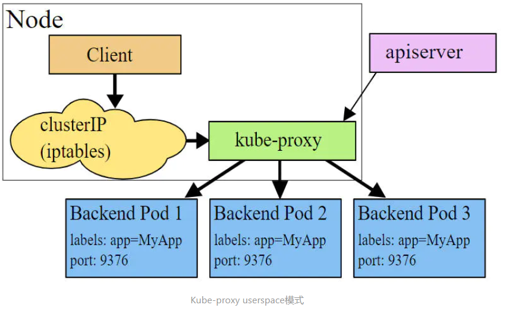
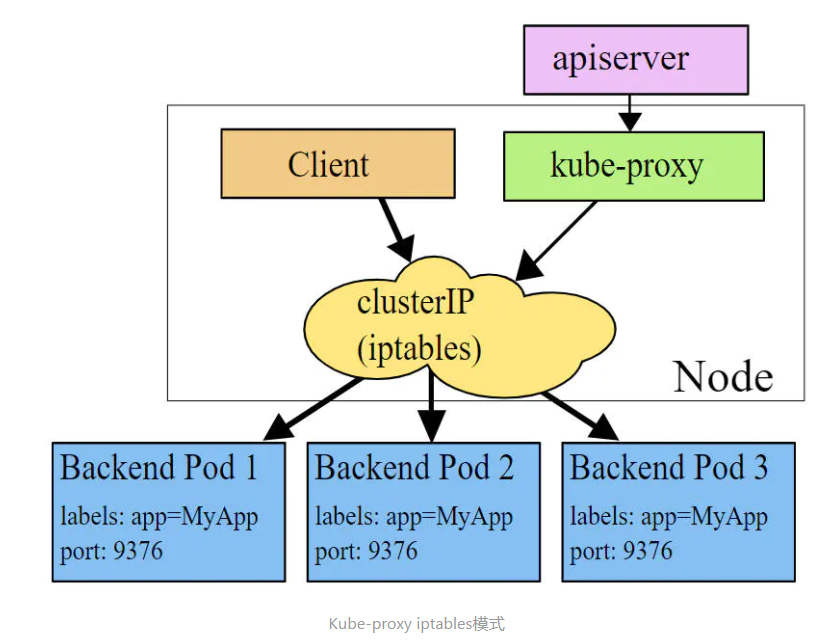
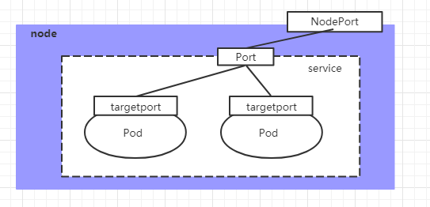

# Kubernetes

## 基本介紹
kubernetes本質是一組server集群，可以在集群的每個節點運行特定的服務，對節點中的容器進行管理，實現資源管理的自動化。
### 主要功能
* 彈性伸縮: 可以根據需要自動對集群中運行的容器數量進行調整
* 服務發現: 服務可以自動發現所依賴的其他服務
* 負載均衡: 自動實現負載均衡
* 版本回退: 版本有問題可以回退至原來的版本
* 儲存編排: 根據容器自身需求自動創建儲存

### 組件
一個kubernetes集群主要是由控制節點(master)及工作節點(node)組成，每個節點安裝不同的組件。

* master: 集群的控制平面，負責集群的管理(決策)
  * ApiServer: 資源操作的唯一入口，接收user輸入的命令，提供認證、授權、API註冊和發現等機制
  * Scheduler: 負責集群資源調度，按照預定的調度策略將Pod調度到相應的node節點上
  * ControllerManager: 負責維護集群的狀態，例如程式部屬安排、故障檢測、自動擴展、滾動更新等
  * Etcd: 負責儲存集群中各種資源對象的資訊
* node: 集群的數據平面，負責為容器提供運行環境(實際執行)
  * Kubelet: 負責維護容器的生命週期，通過控制docker來創建、更新、銷毀容器
  * KubeProxy: 負責提供集群內部的服務發現和負載均衡
  * Docker: 負責節點上容器的各種操作

流程:
1. 一旦kubernetes環境啟動之後，master和node都會將自身的訊息儲存到etcd中
2. 如果要啟動一個nginx服務，服務安裝請求首先會被發送到master的ApiServer組件
3. ApiServer組件會調用scheduler組件決定要把nginx服務安裝到哪個node上，此時scheduler會從etcd中讀取各個node節點的訊息，然後按照一定的算法進行選擇，並將結果告知apiServer
4. apiServer調用controllerManager去調度Node節點安裝nginx服務
5. kubelet收到指令後，會通知docker，然後由docker啟動一個nginx的pod，pod是kubernetes的最小操作單元，容器需要跑在pod中。
6. 一個nginx服務就成功運行了，如果需要訪問nginx，就需要透過kube-proxy對pod產生訪問的代理，這樣外界使用者就可以訪問集群中的nginx服務了

### 概念
* master: 集群控制節點，每個集群需要至少一個master節點負責集群管控
* node: 工作負載節點，由master分配容器到這些node工作節點上，然後由node節點上的docker負責容器的運行
* pod: kubernetes的最小控制單元，容器都是運行在pod中的，一個pod中可以有多個容器
* controller: 控制器，透過它實現對pod的管理，例如啟動pod、停止pod和伸縮pod數量等等
* service: pod對外服務的統一入口，下面可以維護同一類的多個pod
* label: 標籤，用於對pod進行分類，同一類的pod會擁有相同的標籤
* namespace: 命名空間，用來隔離pod的運行環境

## 集群環境搭建

### 集群類型
* 一主多從: 一台master節點和多台node節點，搭建簡單，但有單機故障風險，適合用於測試環境
* 多主多從: 多台master節點和多台node節點，搭建麻煩、安全性高，適用於生產環境

### 主機設置(使用虛擬機)

| Role   | IP              | OS       | Hardware                 |
| :----- | :-------------- | :------- | :----------------------- |
| master | 192.168.187.100 | Centos 7 | 2 cpu 2g memory 50g disk |
| node1  | 192.168.187.101 | Centos 7 | 2 cpu 2g memory 50g disk |
| node2  | 192.168.187.102 | Centos 7 | 2 cpu 2g memory 50g disk |

* IP : 192.168.187.10x
* 子網路: 255.255.255.0
* Gateway: 192.168.187.2
* DNS: 8.8.8.8
* hostname : master、node1、node2

### 環境搭建
1. 確認OS版本符合kubernetes集群要求
```bash
cat /etc/redhat-release
```
2. 配置hosts
```bash
vim /etc/hosts

#三台都要加入以下內容
192.168.187.100 master
192.168.187.101 node1
192.168.187.102 node2
```
3. 同步時間(kubernetes要求集群的節點時間一致)
```bash
# start chronyd service
systemctl start chronyd
# 設定開機自動啟動
systemctl enable chronyd
# 驗證時間
date
```
4. 禁用iptables & firewalld

k8s和docker在運行時會產生大量的iptables規則，為了不讓系統規則與他們混淆，直接關閉系統規則
```bash
systemctl stop firewalld
systemctl disable firewalld

systemctl stop iptables
systemctl disable iptables
```
5. 禁用selinux
```bash
vim /etc/selinux/config

# 更改
SELINUX=disabled
```
6. 禁用swap分區

swap分區是指虛擬記憶體分區，在實際memory使用完後，會將硬碟空間虛擬成記憶體來使用，啟用swap會對系統性能產生負面的影響，因此kubernetes要求每個節點都要禁止使用，但如果因為某些原因不能關閉，需要在集群安裝過程中配置明確的參數說明。
```bash
vim /etc/fstab

# 將swap分區該行註解掉
```
7. 修改linux的內核參數

修改linux的內核參數，添加網路橋接過濾和IP轉發功能
```bash
vim /etc/sysctl.d/kubernetes.conf

# 加入以下內容
net.bridge.bridge-nf-call-ip6tables = 1
net.bridge.bridge-nf-call-iptables = 1
net.ipv4.ip_forward = 1

# 重新加載
sysctl -p

# 加載網路橋接過濾模組
modprobe br_netfilter

# 確認網路橋接過濾模組是否加載成功
lsmod | grep br_netfilter
```
8. 配置ipvs功能

在kubernetes中service有兩種代理模式，一種是基於iptables的，一種是基於ipvs的。兩者比較的話，ipvs的性能比較好一點
，但如果要使用它則需要手動載入ipvs模組。
```bash
# 安裝ipset和ipvsadm
yum install ipset ipvsadm -y

# 將需要加載的模組寫入文件
cat <<EOF >  /etc/sysconfig/modules/ipvs.modules
#!/bin/bash
modprobe -- ip_vs
modprobe -- ip_vs_rr
modprobe -- ip_vs_wrr
modprobe -- ip_vs_sh
modprobe -- nf_conntrack_ipv4
EOF

# 將文件添加執行權限
chmod +x /etc/sysconfig/modules/ipvs.modules

# 執行
/bin/bash /etc/sysconfig/modules/ipvs.modules

# 檢查是否加載成功
lsmod | grep -e ip_vs -e nf_conntrack_ipv4
```

9. 重啟server
```bash
reboot
```

### 安裝docker
1. 安裝
2. 增加配置文件

Docker在默認情況下使用Cgroup Driver為cgroupfs，而kubernetes推薦使用systemd來代替cgroupfs
```bash
mkdir /etc/docker

cat <<EOF >  /etc/docker/daemon.json
{
  "exec-opts": ["native.cgroupdriver=systemd"],
  "registry-mirrors": ["https://kn0t2bca.mirror.aliyuncs.com"]
}
EOF
```
3. 啟動docker
```bash
systemctl start docker
systemctl enable docker
```
4. 檢查docker狀態和版本
```bash
docker version
```

### 安裝kubernetes組件
1. 切換鏡像源
```bash
vim /etc/yum.repos.d/kubernetes.repo

# 加入下面內容
[kubernetes]
name=Kubernetes
baseurl=http://mirrors.aliyun.com/kubernetes/yum/repos/kubernetes-el7-x86_64
enabled=1
gpgcheck=0
repo_gpgcheck=0
gpgkey=http://mirrors.aliyun.com/kubernetes/yum/doc/yum-key.gpg
    http://mirrors.aliyun.com/kubernetes/yum/doc/rpm-package-key.gpg
```

2. 安裝kubeadm、kubelet和kubectl
```bash
yum install --setopt=obsoletes=0 kubeadm-1.17.4-0 kubelet-1.17.4-0 kubectl-1.17.4-0 -y
```

3. 配置kubelet的cgroup
```bash
vim /etc/sysconfig/kubelet

# 加入下面內容
KUBELET_CGROUP_ARGS="--cgroup-driver=systemd"
KUBE_PROXY_MODE="ipvs"
```

4. 設置kubelet開機自動啟動
```bash
systemctl enable kubelet
```

5. 準備集群鏡像
 * 在安裝kubernetes集群之前，需要先提前準備好集群需要的鏡像，所需要的images可以透過下面命令查看
```bash
kubeadm config images list
```
  * 下載images
```bash
images=(
  kube-apiserver:v1.17.4
  kube-controller-manager:v1.17.4
  kube-scheduler:v1.17.4
  kube-proxy:v1.17.4
  pause:3.1
  etcd:3.4.3-0
  coredns:1.6.5
)

for imageName in ${images[@]} ; do
  docker pull registry.cn-hangzhou.aliyuncs.com/google_containers/$imageName
  docker tag registry.cn-hangzhou.aliyuncs.com/google_containers/$imageName k8s.gcr.io/$imageName
  docker rmi registry.cn-hangzhou.aliyuncs.com/google_containers/$imageName
done
```

6. 集群初始化
  * 以下操作只需要在master節點執行
```bash
# 創建集群
kubeadm init \
--kubernetes-version=v1.17.4 \
--pod-network-cidr=10.244.0.0/16 \
--service-cidr=10.96.0.0/12 \
--apiserver-advertise-address=192.168.187.100 # master ip

#創建必要文件
mkdir -p $HOME/.kube

sudo cp -i /etc/kubernetes/admin.conf $HOME/.kube/config

sudo chown $(id -u):$(id -g) $HOME/.kube/config
```
  * 以下操作只需要在node節點執行
```bash
kubeadm join 192.168.56.100:6443 \
--token xxx \
--discovery-token-ca-cert-hash \
sha256:xxx

#詳細內容查看創建集群顯示的資訊
```
  * 查看集群狀態，此時的集群狀態為NotReady，因為尚未配置網路插件
```bash
kubectl get nodes
```

7. 安裝網路插件

kubernetes支援多種網路插件，例如flannel、calico、canal等等，這邊選擇使用flannel。

下面操作只在master節點執行，插件使用的是DaemonSet的控制器，會在每個節點上運行。
  * 取得fannel的配置文件
```bash
wget https://raw.githubusercontent.com/coreos/flannel/master/Documentation/kube-flannel.yml

# 使用配置文件啟動fannel
kubectl apply -f kube-flannel.yml

# 稍等片刻後，再次查看集群節點的狀態
kubectl get nodes
```

!如果安裝flannel之後遇到Node和Node之間連線不通可以參考[此網址](https://blog.csdn.net/qq_47855463/article/details/119682175?spm=1001.2101.3001.6661.1&depth_1-utm_source=distribute.pc_relevant_t0.none-task-blog-2%7Edefault%7ECTRLIST%7ERate-1-119682175-blog-117994075.pc_relevant_multi_platform_whitelistv6&utm_relevant_index=1)，先透過ip link delete刪除flannerl網路後重新啟動網路，接著重新佈署flannel的yaml文件，再透過ip a指令確認flannel有IP位址後進行連線測試。

8. 服務部屬測試
```bash
# 部屬nginx
kubectl create deployment nginx --image=nginx:1.14-alpine

# expose port
kubectl expose deployment nginx --port=80 --type=NodePort

# 查看服務狀態
kubectl get pods

# 嘗試訪問部屬的nginx服務
連線192.168.187.100:port
```

## 資源管理

### 資源管理介紹
在kubernetes中，所有的內容都抽象為資源，用戶需要通過操作資源來管理kubernetes。

kubernetes的本質上就是一個集群系統，用戶可以在集群中部署各種服務，所謂的部署服務其實就是在kubernetes集群中運行容器，並將指定的程式跑在容器中。kubernetes的最小管理單元是pod而不是容器，所以只能將容器放在Pod中，而kubernetes一般也不會直接管理Pod，而是通過Pod控制器來管理Pod。Pod可以提供服務之後，就要考慮如何訪問Pod中服務，kubernetes提供了Service資源實現這個功能。

當然，如果Pod中程式的數據需要持久化，kubernetes還提供了各種Stroage。

學習kubernetes的核心，就是學習如何對集群上的Pod、Pod控制器、Service、Storage等各種資源進行操作。

### YAML
YAML是一個類似XML、JSON的標記性語言。它強調以數據為中心，並不是以標識語言為重點。因此YAML本身的定義比較簡單，號稱"一種人性化的數據格式語言"。
```yaml
Man:
  age: 18
  address: Taiwan
```
YAML的語法比較簡單，主要注意：
  * 大小寫敏感
  * 使用縮進表示層級關係
  * 縮進不允許使用tab，只允許空格(低版本限制)
  * 縮進的空格數不重要，只要相同層級的元素左對齊即可

YAML支援以下幾種數據類型：
* 純量：單個的、不可再分的值
```yaml
# boolean
var: true or True
# int
var: 123
# float
var: 3.14
# null
var: ~
# Date
var: 2022-01-01 #日期必須使用ISO 8601格式，即yyyy-MM-dd
# Time
var: 2022-01-01T15:02:31+08:00 #時間使用ISO 8601格式，時間和日期之間用T連接，最後使用+代表時區
# string
var: abc #直接寫值，如果字串中間有特殊字符則需使用雙引號或單引號包括起來
var: abc
     cde #字串過多可以拆成多航，每行會被轉化成一個空格
```

* 對象：鍵值配對的集合，又稱為映射(mapping) / hash / 字典(dictionary)
```yaml
# Format 1
Man:
  age: 18
  address: Taiwan

# Format 2
Man: {age: 18,address: Taiwan}
```
* 數組：一組按次序排列的值，又稱為序列(sequence) / 列表(list)
```yaml
# Format 1
address:
  - Taipei
  - Tainan
# Format 2
address: [Taipei,Tainan]
```

! Tips:
  1. 寫yaml切記:後面要加一個空格
  2. 如果需要將多段yaml配置放在一個文件中，要用---分隔
  3. 可以透過yaml轉json的網站驗證是否正確(https://www.json2yaml.com/convert-yaml-to-json)

### 資源管理方式
* 命令式對象管理：直接使用命令去操作kubernetes資源
```bash
kubectl run nginx-pod --image=nginx:1.17.1 --port=80
```
* 命令式對象配置：通過命令配置和配置文件去操作kubernetes資源
```bash
kubectl create/patch -f nginx-pod.yaml
```
* 聲明式對象配置：通過apply命令和配置文件去操作kubernetes資源，apply相當於創建和更新功能。
```bash
kubectl apply -f nginx-pod.yaml
```

| 類型           | 操作對象 | 適用環境 | 優點           | 缺點                             |
| :------------- | :------- | :------- | :------------- | :------------------------------- |
| 命令式對象管理 | 對象     | 測試     | 簡單           | 只能操作活動對象，無法審計及跟蹤 |
| 命令式對象配置 | 文件     | 開發     | 可以審計、跟蹤 | 項目大時，配置文件多，操作麻煩   |
| 聲明式對象配置 | 目錄     | 開發     | 支援目錄操作   | 意外情況下難以Debug              |

### 命令式對象管理
#### **kubectl命令**
kubectl是kubernetes集群的命令行工具，透過它能夠對集群本身進行管理，並能夠在集群上進行容器化應用的安裝部署。
```bash
kubectl命令的語法如下：
kubectl [command] [type] [name] [flags]

comand：指定要對資源執行的操作，例如create、get、delete
type：指定資源類型，比如deployment、pod、service
name：指定資源的名稱，名稱大小寫敏感
flags：指定額外的可選參數
```
#### 查看所有pod
```bash
kubectl get pod
```

#### 查看某個pod
```bash
kubectl get pod pod_name
```

#### 查看某個pod並以yaml / json格式輸出
```bash
kubectl get pod pod_name -o yaml
kubectl get pod nginx-6867cdf567-gltkj -o yaml
kubectl get pod nginx-6867cdf567-gltkj -o json
```
#### 資源類型
kubernetes中所有的內容都抽象為資源，可以通過下面的命令進行查看:
```bash
kubectl api-resources
```
常用資源:
| 資源分類      | 資源名稱                 | 簡寫   | 作用            |
| :------------ | :----------------------- | :----- | :-------------- |
| 集群級別資源  | nodes                    | no     | 集群組成部分    |
| 集群級別資源  | namespace                | ns     | 隔離Pod         |
| Pod資源       | pods                     | po     | 裝載容器        |
| Pod資源控制器 | replicationcontrollers   | rc     | 控制pod資源     |
| Pod資源控制器 | replicasets              | rs     | 控制pod資源     |
| Pod資源控制器 | deployments              | deploy | 控制pod資源     |
| Pod資源控制器 | daemonsets               | ds     | 控制pod資源     |
| Pod資源控制器 | jobs                     |        | 控制pod資源     |
| Pod資源控制器 | cronjobs                 | cj     | 控制pod資源     |
| Pod資源控制器 | horizontalpodautoscalers | hpa    | 控制pod資源     |
| Pod資源控制器 | statefulsets             | sts    | 控制pod資源     |
| 服務發現資源  | services                 | svc    | 統一pod對外接口 |
| 服務發現資源  | ingress                  | ing    | 統一pod對外接口 |
| 儲存資源      | volumeattachments        |        | stroage         |
| 儲存資源      | persistentvolumes        | pv     | stroage         |
| 儲存資源      | persistentvolumeclaims   | pvc    | stroage         |
| 配置資源      | configmaps               | cm     | 配置            |
| 配置資源      | secrets                  |        | 配置            |

#### 操作
kubernetes允許對資源進行多種操作，可以通過--help查看詳細的操作命令
```bash
kubectl--help
```

常用操作：
| 命令分類   | 命令         | 命令作用                      |
| :--------- | :----------- | :---------------------------- |
| 基本命令   | create       | 創建一個資源                  |
| 基本命令   | edit         | 編輯一個資源                  |
| 基本命令   | get          | 獲取一個資源                  |
| 基本命令   | patch        | 更新一個資源                  |
| 基本命令   | delete       | 刪除一個資源                  |
| 基本命令   | explain      | 展示一個資源                  |
| 運行與調試 | run          | 在集群中運行一個指定的鏡像    |
| 運行與調試 | expose       | 暴露資源為Service             |
| 運行與調試 | describe     | 顯示資源內部訊息              |
| 運行與調試 | logs         | 輸出容器在pod中的日誌         |
| 運行與調試 | attach       | 進入運行中的容器              |
| 運行與調試 | exec         | 執行容器中的一個命令          |
| 運行與調試 | cp           | 在Pod內外複製文件             |
| 運行與調試 | rollout      | 管理資源的發布                |
| 運行與調試 | scale        | 擴展(縮減)Pod的數量           |
| 運行與調試 | autoscale    | 自動調整Pod的數量             |
| 高級命令   | apply        | 透過文件對資源進行配置        |
| 高級命令   | label        | 更新資源的標籤                |
| 其他命令   | cluster-info | 顯示集群訊息                  |
| 其他命令   | version      | 顯示當前Service和Client的版本 |

### 命令式對象配置
命令式對象配置就是使用命令配合配置文件一起來操作kubernetes資源。
1. 創建一個nginxpod.yaml
2. 寫入內容如下
```yaml
apiVersion: v1
kind: Namespace
metadata:
  name: dev
---
apiVersion: v1
kind: Pod
metadata:
  name: nginxpod
  namespace: dev
spec:
  containers:
  - name: nginx-containers
    image: nginx:1.17.1
```
3. 執行create命令創建資源
```bash
kubectl create -f nginxpod.yaml
```
4. 執行get命令查看資源
```bash
kubectl get -f nginxpod.yaml
```
5. 執行delete命令刪除資源
```bash
kubectl delete -f nginxpod.yaml
```

總結:命令式對象配置的方式操作資源，可以簡單的認為：命令 +  yaml配置文件(裡面是命令需要的各種參數)

### 聲明式對象配置
聲明式對象配置跟命令式對象配置很相似，但是它只有一個命令apply。
1. 執行kubectl apply -f yaml文件創建資源
2. 再執行一次kubectl apply -f yaml發現資源沒有變動，配置文件沒有更新所以沒有變動，如果有更新配置文件的話資源也對跟著改變。

總結:其實聲明式對象配置就是使用apply描述一個資源最終的狀態(在yaml中定義狀態)

使用apply操作資源：
+ 如果資源不存在，就創建，相當於kubectl create
+ 如果資源已存在，就更新，相當於kubectl patch

### 三種方式應該怎麼用?
+ 創建/更新資源: 使用聲明式對象配置kubectl apply -f XXX.yaml
+ 刪除資源: 使用命令式對象配置kubectl delete -f XXX.yaml
+ 查詢資源: 使用命令式對像管理kubectl get(describe) 資源名稱

### kubectl可以在node節點上執行嗎?
kubectl的運行是需要進行配置的，它的配置文件是$HOME/.kube，如果想要在node節點運行此命令，需要將master上的.kube文件複製到node節點上，即在master節點上執行下面操作：
```bash
scp -r HOME/.kube node1:HOME/
```

## namespace
Namespace是kubernetes系統中的一種非常重要的資源，它的主要作用是用來實現多環境的資源隔離或者多租戶的資源隔離。

默認情況下，kubernetes集群中的所有的Pod都是可以相互訪問的。但是在實際情況中，可能不想讓兩個Pod之間互相訪問，那此時就可以將兩個Pod劃分到不同的namespace下。kubernetes透過將集群內部的資源分配到不同的Namespace中，可以形成邏輯上的"組"，以方便不同組的資源進行隔離使用和管理。

可以透過kubernetes的授權機制，將不同的namespace交給不同租戶進行管理，這樣就實現了多租戶的資源隔離。此時還能結合kubernetes的資源配額機制，限定不同租戶能佔用的資源，例如CPU使用量、記憶體使用量等等，來實現租戶可用資源的管理。

namespace本身是一種邊界，透過邊界的設定可以實現資源隔離。

kubernetes在集群啟動之後，會默認創建幾個namespace：
```bash
kubectl get namespace

NAME STATUS AGE
default Active 45h # 所有未指定Namespace的對像都會被分配在default命名空間

kube-node-lease Active 45h # 集群節點之間的心跳維護，v1.13開始引入

kube-public Active 45h # 此命名空間下的資源可以被所有人訪問(包括未認證用戶)

kube-system Active 45h # 所有由Kubernetes系統創建的資源都處於這個命名空間
```

## Pod
Pod是kubernetes集群進行管理的最小單元，程式要運行必須部署在容器中，而容器必須存在於Pod中。

Pod可以認為是容器的封裝，一個Pod中可以存在一個或者多個容器。

k8s透過管理pod進而控制容器並控制裡面的程式。


kubernetes在集群啟動之後，集群中的各個組件也都是以Pod方式運行的。可以通過下面命令查看：
```bash
kubectl get pod -n kube-system
```

### 創建並運行
kubernetes沒有提供單獨運行Pod的命令，都是通過Pod控制器來實現的
```bash
# 命令格式： kubectl run (pod控制器名稱) [參數]

# --image 指定Pod的鏡像
# --port 指定端口
# --namespace 指定namespace
kubectl run nginx --image=nginx:1.17.1 --port=80 --namespace dev
```

## Label
Label是kubernetes系統中的一個重要概念，它的作用就是在資源上添加標識，用來對它們進行區分和選擇。

* Label的特點：一個Label會以key/value鍵值對的形式附加到各種對象上，如Node、Pod、Service等等
* 一個資源對象可以定義任意數量的Label ，同一個Label也可以被添加到任意數量的資源對象上去
* Label通常在資源對象定義時確定，當然也可以在對象創建後動態添加或者刪除
* 可以透過Label實現資源的多維度分組，以便靈活、方便地進行資源分配、調度、配置、部署等管理工作。

一些常用的Label範例：
```
版本標籤："version":"release", "version":"stable"......

環境標籤："environment":"dev"，"environment":"test"，"environment":"pro"

架構標籤："tier":"frontend"，"tier":"backend"
```
標籤定義完畢之後，還要考慮到標籤的選擇，這就要使用到Label Selector，即：
* Label用於給某個資源對象定義標識
* Label Selector用於查詢和篩選擁有某些標籤的資源對象

當前有兩種Label Selector：
* 基於等式的Label Selector
```
name = slave: 選擇所有包含Label中key="name"且value="slave"的對象

env != production: 選擇所有包括Label中的key="env"且value不等於"production"的對象
```
* 基於集合的Label Selector
```
name in (master, slave): 選擇所有包含Label中的key="name"且value="master"或"slave"的對象

name not in (frontend): 選擇所有包含Label中的key="name"且value不等於"frontend"的對象
```
標籤的選擇條件可以使用多個，此時將多個Label Selector進行組合，使用逗號","進行分隔即可。例如：
```
name=slave，env!=production

name not in (frontend)，env!=production
```

### 命令方式
```bash
# 為pod資源打標籤
kubectl label pod nginx-pod version=1.0 -n dev

# 為pod資源更新標籤
kubectl label pod nginx-pod version=2.0 -n dev --overwrite

# 查看標籤
kubectl get pod nginx-pod -n dev --show-labels

# 篩選標籤
kubectl get pod -n dev -l version=2.0 --show-label
kubectl get pod -n dev -l version!=2.0 --show-labels

#刪除標籤
kubectl label pod nginx-pod version- -n dev
```

### 配置方式
```yaml
apiVersion: v1
kind: Pod
metadata:
  name: nginx
  namespace: dev
  labels:
   version: "3.0"
   env: "test"
spec:
  containers:
  - image: nginx:1.17.1
    name: pod
    ports:
    - name: nginx-port
      containerPort: 80
      protocol: TCP
```

## Deployment
在kubernetes中，Pod是最小的控制單元，但是kubernetes很少直接控制Pod，一般都是透過Pod控制器來完成的。Pod控制器用於pod的管理，確保pod資源符合預期的狀態，當pod的資源出現故障時，會嘗試進行重啟或重建pod。

pod與deployment建立聯繫是通過label實現的。


### 命令操作
```bash
# 命令格式: kubectl run deployment名稱 [參數]

# --image 指定pod的鏡像
# --port 指定端口
# --replicas 指定創建pod數量
# --namespace 指定namespace

kubectl run nginx --image=nginx:1.17.1 --port=80 --replicas=3 -n dev

# 查看創建的Pod
kubectl get pods -n dev

# 查看deployment的信息
kubectl get deployment,pods -n dev

# 查看deployment的詳細信息
kubectl describe deploy nginx -n dev

# 刪除
kubectl delete deploy nginx -n dev
```

### 配置操作
創建一個deploy-nginx.yaml，內容如下：
```bash
apiVersion: apps/v1
kind: Deployment
metadata:
  name: nginx
  namespace: dev
spec:
  replicas: 3
  selector:
   matchLabels:
     run: nginx
  template:
   metadata:
     labels:
       run: nginx
   spec:
     containers:
     - image: nginx:1.17.1
       name: nginx
       ports:
       - containerPort: 80
         protocol: TCP
```

## Service
雖然每個Pod都會分配一個單獨的Pod IP，然而卻存在如下兩個問題：
* Pod IP 會隨著Pod的重建產生變化
* Pod IP 僅僅是集群內可見的虛擬IP，外部無法訪問

這樣對於訪問這個服務帶來了難度。因此，kubernetes設計了Service來解決這個問題。

Service可以看作是一組同類Pod對外的訪問接口。借助Service，應用可以方便地實現服務發現和負載均衡。

### 創建集群內部可訪問的Service
```bash
# 暴露Service
kubectl expose deploy nginx --name=svc-nginx1 --type=ClusterIP --port=80 --target-port=80 -n dev

# 查看service

kubectl get svc svc-nginx -n dev -o wide

NAME TYPE CLUSTER-IP EXTERNAL-IP PORT(S) AGE SELECTOR

svc-nginx1 ClusterIP 10.109.179.231 <none> 80/TCP 3m51s run=nginx

# 這裡產生的CLUSTER-IP就是service的IP，在Service的生命週期中，這個地址是不會變動的

# 可以通過這個IP訪問當前service對應的POD
curl 10.109.179.231:80
```

### 創建集群外部也可訪問的Service
```bash
# 上面創建的Service的type類型為ClusterIP，這個ip地址只用集群內部可訪問

# 如果需要創建外部也可以訪問的Service，需要修改type為NodePort
kubectl expose deploy nginx --name=svc-nginx2 --type=NodePort --port=80 --target-port=80 -n dev

# 此時查看，會發現出現了NodePort類型的Service，而且有一對Port(80:31928/TC)
kubectl get svc svc-nginx-1 -n dev -o wide

NAME TYPE CLUSTER-IP EXTERNAL-IP PORT(S) AGE SELECTOR

svc-nginx2 NodePort 10.100.94.0 <none> 80:31928 TCP 9s run=nginx

# 接下來就可以通過集群外的主機訪問節點IP:31928訪問服務了

# 例如在的電腦主機上通過瀏覽器訪問下面的地址 
http://192.168.109.100:31928/


# 刪除Service
kubectl delete svc svc-nginx-1 -n dev service "svc-nginx-1" deleted
```
### 配置方式
創建一個svc-nginx.yaml，內容如下：
```bash
apiVersion: v1
kind: Service
metadata:
  name: svc-nginx
  namespace: dev
spec:
  clusterIP: 10.109.179.231
  ports:
  - port: 80
    protocol: TCP
    targetPort: 80
  selector:
    run: nginx
    type: ClusterIP

然後就可以執行對應的創建和刪除命令了：

    創建：kubectl create -f svc-nginx.yaml

    刪除：kubectl delete -f svc-nginx.yam
```

## Pod詳解
每個Pod中都可以包含一個或者多個容器，這些容器可以分為兩類：
* 用戶程序所在的容器，數量可多可少
* Pause容器，這是每個Pod都會有的一個根容器，它的作用有兩個：
  * 可以以它為依據，評估整個Pod的健康狀態
  * 可以在根容器上設置Ip地址，其它容器都此Ip(Pod IP)，以實現Pod內部的網路通信(這裡是Pod內部的通訊，Pod的之間的通訊採用虛擬二層網絡技術來實現)

### Pod定義
資源清單:
```yaml
apiVersion: v1     #必填，版本号
kind: Pod       　 #必填，資源類型，Ex: Pod、Service
metadata:       　 #必填
  name: string     #必填，Pod名稱
  namespace: string  #Pod's namespace，默認是"default"
  labels:       　　  #自定義標籤
    - name: string      　          
spec:  #必填，Pod中容器的詳細定義
  containers:  #必填，Pod中容器列表
  - name: string   #必填，容器名稱
    image: string  #必填，container image
    imagePullPolicy: [ Always|Never|IfNotPresent ]  #拉取image策略 
    command: [string]   #容器的啟動命令列表，如不指定，使用打包時使用的啟動命令
    args: [string]      #容器的啟動命令參數列表
    workingDir: string  #容器的工作目錄
    volumeMounts:       #掛載到容器内部的儲存卷配置
    - name: string      #引用pod定義的共享儲存卷的名稱，需用volumes[]部分定義的的卷名
      mountPath: string #儲存卷在容器内mount的絕對路徑，長度應少於512
      readOnly: boolean #是否為read-only
    ports: #需要暴露的port列表
    - name: string        #port name
      containerPort: int  #容器需要監聽的port
      hostPort: int       #容器所在主機需要監聽的port，默認和Container相同
      protocol: string    #port協議，支援TCP和UDP，默認TCP
    env:   #容器運行前需設置的環境變數列表
    - name: string  #環境變數的名稱
      value: string #環境變數的值
    resources: #資源限制和請求的設置
      limits:  #資源限制的設置
        cpu: string     #Cpu的限制，單位為core數量，用於docker run --cpu-shares參數
        memory: string  #記憶體限制，單位可以為Mib/Gib，用於docker run --memory参数
      requests: #資源請求的設置
        cpu: string    #Cpu請求，容器啟動的初始可用數量
        memory: string #記憶體請求，容器啟動的初始可用數量
    lifecycle: #生命周期
        postStart: #容器啟動後立即執行，如果執行失敗，會根據重啟策略重啟
        preStop: #容器终止前執行，無論结果如何，容器都会终止
    livenessProbe:  #對Pod内各容器健康檢查的設置，當探測無回應幾次後將自動重啟该容器
      exec:       　 #對Pod容器内檢查方式設置為exec方式
        command: [string]  #exec方式需要制定的命令或腳本
      httpGet:       #对Pod内个容器健康檢查方法設置為HttpGet，需要制定Path、port
        path: string
        port: number
        host: string
        scheme: string
        HttpHeaders:
        - name: string
          value: string
      tcpSocket:     #對Pod内各個容器健康檢查方式設置為tcpSocket方式
         port: number
       initialDelaySeconds: 0       #容器啟動完成後首次探測的時間，單位為秒
       timeoutSeconds: 0    　　    #對容器健康檢查探測等待回應的超過時間，單位為秒，默認1秒
       periodSeconds: 0     　　    #對容器監控檢查的定期探測的時間設置，單位為秒，默認10秒一次
       successThreshold: 0
       failureThreshold: 0
       securityContext:
         privileged: false
  restartPolicy: [Always | Never | OnFailure]  #Pod的重啟策略
  nodeName: <string> #設置NodeName表示將該Pod調度到指定名稱的node節點上
  nodeSelector: obeject #設置NodeSelector表示將该Pod調度到包含這個label的node上
  imagePullSecrets: #Pull image時使用的secret名稱，以key：secretkey格式指定
  - name: string
  hostNetwork: false   #是否使用主機網路模式，默認為false，如果設置為true，表示使用宿主機網路
  volumes:   #在該pod上定義共享儲存卷列表
  - name: string    #共享儲存卷名稱 (volumes類型有很多種)
    emptyDir: {}       #類型為emtyDir的儲存卷，與Pod同生命周期的一個臨時目錄。為空值
    hostPath: string   #類型為hostPath的儲存卷，表示掛載Pod所在宿主機的目錄
      path: string      　　        #Pod所在宿主機的目錄，將被用於同期中mount的目錄
    secret:       　　　#類型为secret的儲存卷，掛載集群與定義的secret對象到容器内部
      scretname: string  
      items:     
      - key: string
        path: string
    configMap:         #類型為configMap的儲存卷，掛載預定義的configMap對象到容器内部
      name: string
      items:
      - key: string
        path: string
```
```bash
#可以透過explain来查看每種資源的可配置項目
#   kubectl explain 資源類型     查看某種資源可以配置的一級属性
#   kubectl explain 資源類型.属性     查看属性的子属性
[root@k8s-master01 ~]# kubectl explain pod
KIND:     Pod
VERSION:  v1
FIELDS:
   apiVersion   <string>
   kind <string>
   metadata     <Object>
   spec <Object>
   status       <Object>

[root@k8s-master01 ~]# kubectl explain pod.metadata
KIND:     Pod
VERSION:  v1
RESOURCE: metadata <Object>
FIELDS:
   annotations  <map[string]string>
   clusterName  <string>
   creationTimestamp    <string>
   deletionGracePeriodSeconds   <integer>
   deletionTimestamp    <string>
   finalizers   <[]string>
   generateName <string>
   generation   <integer>
   labels       <map[string]string>
   managedFields        <[]Object>
   name <string>
   namespace    <string>
   ownerReferences      <[]Object>
   resourceVersion      <string>
   selfLink     <string>
   uid  <string>
```

在kubernetes中基本所有資源的一級屬性都是一樣的，主要包含5部分：
* apiVersion 版本，由kubernetes內部定義，版本號可以用kubectl api-versions 查詢
* kind 類型，由kubernetes內部定義，可以用kubectl api-resources 查詢
* metadata 元數據，主要是資源標識和說明，常用的有name、namespace、labels等
* spec 描述，這是配置中最重要的一部分，裡面是對各種資源配置的詳細描述
* status 狀態訊息，裡面的內容不需要定義，由kubernetes自動生成

在上面的屬性中，spec是接下來研究的重點，繼續看下它的常見子屬性:
* containers <[]Object>: 容器列表，用於定義容器的詳細信息
* nodeName: 根據nodeName的值將pod調度到指定的Node節點上
* nodeSelector <map[]>: 根據NodeSelector中定義的資訊選擇將該Pod調度到包含這些label的Node上
* hostNetwork: 是否使用主機網路模式，默認為false，如果設置為true，表示使用宿主機網路
* volumes <[]Object>: 儲存卷，用於定義Pod上面掛在的儲存資訊
* restartPolicy: 重啟策略，表示Pod在遇到故障的時候的處理策略

### Pod配置

#### Pull image
imagePullPolicy，用於設置鏡像拉取策略，kubernetes支援三種拉取策略：
* Always：總是從遠程倉庫拉取鏡像(一直遠程下載)
* IfNotPresent：本地有則使用本地鏡像，本地沒有則從遠程倉庫拉取鏡像(本地有就本地本地沒遠程下載)
* Never：只使用本地鏡像，從不去遠程倉庫拉取，本地沒有就報錯(一直使用本地)
```bash
默認值說明：
如果image tag為具體版本號， 默認策略是：IfNotPresent
如果image tag為：latest(最終版本) ，默認策略是always
```

#### 啟動命令
```yaml
apiVersion: v1
kind: Pod
metadata:
  name: pod-command
  namespace: dev
spec:
  containers:
  - name: nginx
    image: nginx:1.17.1
  - name: busybox
    image: busybox:1.30
    command: ["/bin/sh","-c","touch /tmp/hello.txt;while true;do /bin/echo $(date +%T) >> /tmp/hello.txt; sleep 3; done;"]
```
```bash
"/bin/sh","-c", 使用sh執行命令

touch /tmp/hello.txt; 建立一個/tmp/hello.txt 文件

while true;do /bin/echo $(date +%T) >> /tmp/hello.txt; sleep 3; done; 每隔3秒向文件中寫入當前時間
```
特別說明：

    透過上面發現command已經可以完成啟動命令和傳遞參數的功能，為什麼這裡還要提供一個args選項，用於傳遞參數呢?這其實跟docker有關，kubernetes中的command、args兩項其實是實現覆蓋Dockerfile中ENTRYPOINT的功能。
1. 如果command和args均沒有寫，那麼用Dockerfile的配置。
2. 如果command寫了，但args沒有寫，那麼Dockerfile預設的配置會被忽略，執行輸入的command
3. 如果command沒寫，但args寫了，那麼Dockerfile中配置的ENTRYPOINT的命令會被執行，使用當前args的參數
4. 如果command和args都寫了，那麼Dockerfile的配置被忽略，執行command並追加上args參數

#### 資源配額
容器中的程式要運行，肯定是要佔用一定資源的，比如cpu和記憶體等，如果不對某個容器的資源做限制，那麼它就可能吃掉大量資源，導致其它容器無法運行。針對這種情況，kubernetes提供了對記憶體和cpu的資源進行配額的機制，這種機制主要通過resources選項實現，他有兩個子選項：
*	limits：用於限制運行時容器的最大佔用資源，當容器佔用資源超過limits時會被終止，並進行重啟
*	requests ：用於設置容器需要的最小資源，如果環境資源不夠，容器將無法啟動

## Pod生命週期
Pod對像從創建至終止的這段時間範圍稱為pod的生命週期，它主要包含下面的過程：
* pod創建過程
* 運行初始化容器(init container)過程
* 運行主容器(main container)
  * post start & pre stop
  * 容器的存活性探測(liveness probe)、就緒性探測(readiness probe)
* pod終止過程

在整個生命週期中，Pod會出現5種狀態，分別如下：
* 掛起(Pending)：apiserver已經創建了pod資源對象，但它尚未被調度完成或者仍處於下載鏡像的過程中
* 運行中(Running)：pod已經被調度至某節點，並且所有容器都已經被kubelet創建完成
* 成功(Succeeded)：pod中的所有容器都已經成功終止並且不會被重啟
失敗(Failed)：所有容器都已經成功終止，但至少有一個容器終止失敗，即容器返回了非0值的退出狀態
* 未知(Unknown)：apiserver無法正常獲取到pod對象的狀態訊息，通常由網路通信失敗所導致

### 創建與終止
Pod的創建過程
1. 用戶通過kubectl或其他api客戶端提交需要創建的pod訊息給apiServer
2. apiServer開始生成pod對象的訊息，並將訊息存入etcd，然後返回確認訊息至客戶端
3. apiServer開始反映etcd中的pod對象的變化，其它組件使用watch機制來跟踪檢查apiServer上的變動
4. scheduler發現有新的pod對像要創建，開始為Pod分配主機並將結果更新至apiServer
5. node節點上的kubelet發現有pod調度過來，嘗試調用docker啟動容器，並將結果回送至apiServer
6. apiServer將接收到的pod狀態訊息存入etcd中

Pod的終止過程
1. 用戶向apiServer發送刪除pod對象的命令
2. apiServcer中的pod對象訊息會隨著時間的推移而更新，在寬限期內(默認30s)，pod被視為dead
3. 將pod標記為terminating狀態
4. kubelet在監控到pod對象轉為terminating狀態的同時啟動pod關閉過程
5. 端點控制器監控到pod對象的關閉行為時將其從所有匹配到此端點的service資源的端點列表中移除
6. 如果當前pod對象定義了preStop鉤子處理器，則在其標記為terminating後即會以同步的方式啟動執行
7. pod對像中的容器進程收到停止信號
8. 寬限期結束後，若pod中還存在仍在運行的進程，那麼pod對象會收到立即終止的信號
9. kubelet請求apiServer將此pod資源的寬限期設置為0從而完成刪除操作，此時pod對於用戶已不可見

### 初始化容器
初始化容器是在pod的主容器啟動之前要運行的容器，主要是做一些主容器的前置工作，它具有兩大特徵：
* 初始化容器必須運行完成直至結束，若某初始化容器運行失敗，那麼kubernetes需要重啟它直到成功完成
* 初始化容器必須按照定義的順序執行，當前一個成功之後，後面的一個才能運行

初始化容器有很多的應用場景，下面列出的是最常見的幾個：
* 提供主容器鏡像中不具備的工具程序或自定義代碼
* 初始化容器要先於應用容器串行啟動並運行完成，因此可用於延後應用容器的啟動直至其依賴的條件得到滿足

案例:

假設要以主容器來運行nginx，但是要求在運行nginx之前先要能夠連接上mysql和redis所在伺服器。為了簡化測試，事先規定好mysql(192.168.90.14)和redis(192.168.90.15)伺服器的地址。

創建pod-initcontainer.yaml，內容如下：
```bash
apiVersion: v1
kind: Pod
metadata:
  name: pod-initcontainer
  namespace: dev
spec:
  containers:
  - name: main-container
    image: nginx:1.17.1
    ports: 
    - name: nginx-port
      containerPort: 80
  initContainers:
  - name: test-mysql
    image: busybox:1.30
    command: ['sh', '-c', 'until ping 192.168.90.14 -c 1 ; do echo waiting for mysql...; sleep 2; done;']
  - name: test-redis
    image: busybox:1.30
    command: ['sh', '-c', 'until ping 192.168.90.15 -c 1 ; do echo waiting for reids...; sleep 2; done;']
```

### 鉤子函數
鉤子函數能夠感知自身生命週期中的事件，並在相應的時刻到來時運行用戶指定的程式碼。

kubernetes在主容器的啟動之後和停止之前提供了兩個鉤子函數：
* post start：容器創建之後執行，如果失敗了會重啟容器
* pre stop ：容器終止之前執行，執行完成之後容器將成功終止，在其完成之前會阻塞刪除容器的操作
* 
鉤子處理器支援使用下面三種方式定義動作：
*	Exec命令: 在容器內執行一次命令
```yaml
……
  lifecycle:
    postStart: 
      exec:
        command:
        - cat
        - /tmp/healthy
……
```

* TCPSocket: 在當前容器嘗試訪問指定的socket
```yaml
……      
  lifecycle:
    postStart:
      tcpSocket:
        port: 8080
……
```
* HTTPGet: 在當前容器中向某url發起http請求
```yaml
……
  lifecycle:
    postStart:
      httpGet:
        path: / #URI地址
        port: 80
        host: 192.168.5.3 #主機地址
        scheme: HTTP #支援的協議，http or https
……
```

範例yaml:
```yaml
apiVersion: v1
kind: Pod
metadata:
  name: pod-hook-exec
  namespace: dev
spec:
  containers:
  - name: main-container
    image: nginx:1.17.1
    ports:
    - name: nginx-port
      containerPort: 80
    lifecycle:
      postStart: 
        exec: # 在容器啟動時執行命令，修改nginx的首頁
          command: ["/bin/sh", "-c", "echo postStart... > /usr/share/nginx/html/index.html"]
      preStop:
        exec: # 在容器停止之前停止nginx服务
          command: ["/usr/sbin/nginx","-s","quit"]
```

### 容器探測
容器探測用於檢測容器中的應用實例是否正常工作，是保障業務可用性的一種傳統機制。如果經過探測，實例的狀態不符合預期，那麼kubernetes就會把該問題實例"摘除"，不承擔業務流量。

kubernetes提供了兩種探針來實現容器探測，分別是：
*	liveness probes：存活性探針，用於檢測應用實例當前是否處於正常運行狀態，如果不是，k8s會重啟容器
*	readiness probes：就緒性探針，用於檢測應用實例當前是否可以接收請求，如果不能，k8s不會轉發流量

livenessProbe 決定是否重啟容器，readinessProbe 決定是否將請求轉發給容器。

上面兩種探針目前均支援三種探測方式：
*	Exec命令: 在容器內執行一次命令，如果命令執行的退出碼為0，則認為程式正常，否則不正常
```yaml
……
  livenessProbe:
    exec:
      command:
      - cat
      - /tmp/healthy
……
```

* TCPSocket: 將嘗試訪問一個用戶容器的port，如果能夠建立連接，則認為正常，否則不正常
```yaml
……      
  livenessProbe:
    tcpSocket:
      port: 8080
……
```

* HTTPGet: 調用容器內Web應用的URL，如果返回的狀態碼在200和399之間，則認為程式正常，否則不正常
```yaml
……
  livenessProbe:
    httpGet:
      path: / #URI地址
      port: 80 
      host: 127.0.0.1 #主機地址
      scheme: HTTP #支援的協議，http or https
……
```
範例:
* 方式一: Exec

創建pod-liveness-exec.yaml
```yaml
apiVersion: v1
kind: Pod
metadata:
  name: pod-liveness-exec
  namespace: dev
spec:
  containers:
  - name: nginx
    image: nginx:1.17.1
    ports: 
    - name: nginx-port
      containerPort: 80
    livenessProbe:
      exec:
        command: ["/bin/cat","/tmp/hello.txt"]
```
```bash
# 創建Pod
[root@k8s-master01 ~]# kubectl create -f pod-liveness-exec.yaml
pod/pod-liveness-exec created

# 查看Pod详情
[root@k8s-master01 ~]# kubectl describe pods pod-liveness-exec -n dev
......
  Normal   Created    20s (x2 over 50s)  kubelet, node1     Created container nginx
  Normal   Started    20s (x2 over 50s)  kubelet, node1     Started container nginx
  Normal   Killing    20s                kubelet, node1     Container nginx failed liveness probe, will be restarted
  Warning  Unhealthy  0s (x5 over 40s)   kubelet, node1     Liveness probe failed: cat: can't open '/tmp/hello11.txt': No such file or directory
  
# 觀察上面的資訊就會發現nginx容器啟動之後就進行了健康檢查
# 檢查失敗之後，容器被kill，然後嘗試進行重啟(這是重啟策略的作用)
# 稍等一會之後，再觀察pod資訊，就可以看到RESTARTS不再是0，而是一直增長

[root@k8s-master01 ~]# kubectl get pods pod-liveness-exec -n dev
NAME                READY   STATUS             RESTARTS   AGE
pod-liveness-exec   0/1     CrashLoopBackOff   2          3m19s

# 當然接下來，可以修改成一個存在的檔，比如/tmp/hello.txt，再試，結果就會正常了
```

* 方法二: TCPSocket

創建pod-liveness-tcpsocket.yaml
```yaml
apiVersion: v1
kind: Pod
metadata:
  name: pod-liveness-tcpsocket
  namespace: dev
spec:
  containers:
  - name: nginx
    image: nginx:1.17.1
    ports: 
    - name: nginx-port
      containerPort: 80
    livenessProbe:
      tcpSocket:
        port: 8080 # 訪問8080 port
```
```bash
# 創建Pod
[root@k8s-master01 ~]# kubectl create -f pod-liveness-tcpsocket.yaml
pod/pod-liveness-tcpsocket created

# 查看Pod詳情
[root@k8s-master01 ~]# kubectl describe pods pod-liveness-tcpsocket -n dev
......
  Normal   Scheduled  31s                            default-scheduler  Successfully assigned dev/pod-liveness-tcpsocket to node2
  Normal   Pulled     <invalid>                      kubelet, node2     Container image "nginx:1.17.1" already present on machine
  Normal   Created    <invalid>                      kubelet, node2     Created container nginx
  Normal   Started    <invalid>                      kubelet, node2     Started container nginx
  Warning  Unhealthy  <invalid> (x2 over <invalid>)  kubelet, node2     Liveness probe failed: dial tcp 10.244.2.44:8080: connect: connection refused
  
# 觀察上面的訊息，發現嘗試8080 port，但是失败

[root@k8s-master01 ~]# kubectl get pods pod-liveness-tcpsocket  -n dev
NAME                     READY   STATUS             RESTARTS   AGE
pod-liveness-tcpsocket   0/1     CrashLoopBackOff   2          3m19s

# 可以修改成可以訪問的port，比如80，结果就正常了
```

* 方法三: HttpGet
創建pod-liveness-httpget.yaml
```yaml
apiVersion: v1
kind: Pod
metadata:
  name: pod-liveness-httpget
  namespace: dev
spec:
  containers:
  - name: nginx
    image: nginx:1.17.1
    ports:
    - name: nginx-port
      containerPort: 80
    livenessProbe:
      httpGet:  # 訪問http://127.0.0.1:80/hello  
        scheme: HTTP #支援的協議，http or https
        port: 80
        path: /hello #URI地址
```
```bash
# 創建Pod
[root@k8s-master01 ~]# kubectl create -f pod-liveness-httpget.yaml
pod/pod-liveness-httpget created

# 查看Pod詳情
[root@k8s-master01 ~]# kubectl describe pod pod-liveness-httpget -n dev
.......
  Normal   Pulled     6s (x3 over 64s)  kubelet, node1     Container image "nginx:1.17.1" already present on machine
  Normal   Created    6s (x3 over 64s)  kubelet, node1     Created container nginx
  Normal   Started    6s (x3 over 63s)  kubelet, node1     Started container nginx
  Warning  Unhealthy  6s (x6 over 56s)  kubelet, node1     Liveness probe failed: HTTP probe failed with statuscode: 404
  Normal   Killing    6s (x2 over 36s)  kubelet, node1     Container nginx failed liveness probe, will be restarted
  
# 觀察上面訊息，嘗試訪問路徑，但是未找到，404 error

[root@k8s-master01 ~]# kubectl get pod pod-liveness-httpget -n dev
NAME                   READY   STATUS    RESTARTS   AGE
pod-liveness-httpget   1/1     Running   5          3m17s

# 可以修改成可以訪問的路徑path，比如/，结果就正常
```

livenessProbe的其他子屬性:
```bash
[root@k8s-master01 ~]# kubectl explain pod.spec.containers.livenessProbe
FIELDS:
   exec <Object>  
   tcpSocket    <Object>
   httpGet      <Object>
   initialDelaySeconds  <integer>  # 容器啟動後等待多少秒執行第一次探測
   timeoutSeconds       <integer>  # 探測超時時間。默認1秒，最小1秒
   periodSeconds        <integer>  # 執行探測的頻率。默認是10秒，最小1秒
   failureThreshold     <integer>  # 連續探測失敗多少次才被認定為失敗。默認是3。最小值是1
   successThreshold     <integer>  # 連續探測成功多少次才被認定為成功。默認是1
```

### 重啟策略
一旦容器探測出現了問題，kubernetes就會對容器所在的Pod進行重啟，其實這是由pod的重啟策略決定的，pod的重啟策略有3種，分別如下：
*	Always ：容器失效時，自動重啟該容器，預設值。
*	OnFailure ： 容器終止運行且退出碼不為0時重啟
*	Never ： 不論狀態為何，都不重啟該容器

重啟策略適用於pod物件中的所有容器，首次需要重啟的容器，將在其需要時立即進行重啟，隨後再次需要重啟的操作將由kubelet延遲一段時間後進行，且反復的重啟操作的延遲時長以此為10s、20s、40s、80s、160s和300s，300s是最大延遲時長。

創建pod-restartpolicy.yaml：
```yaml
apiVersion: v1
kind: Pod
metadata:
  name: pod-restartpolicy
  namespace: dev
spec:
  containers:
  - name: nginx
    image: nginx:1.17.1
    ports:
    - name: nginx-port
      containerPort: 80
    livenessProbe:
      httpGet:
        scheme: HTTP
        port: 80
        path: /hello
  restartPolicy: Never # 設置重啟策略為never
```
```bash
# 創建Pod
[root@k8s-master01 ~]# kubectl create -f pod-restartpolicy.yaml
pod/pod-restartpolicy created

# 查看Pod，發現nginx container failed
[root@k8s-master01 ~]# kubectl  describe pods pod-restartpolicy  -n dev
......
  Warning  Unhealthy  15s (x3 over 35s)  kubelet, node1     Liveness probe failed: HTTP probe failed with statuscode: 404
  Normal   Killing    15s                kubelet, node1     Container nginx failed liveness probe
  
# 觀察pod的重啟次數一直為0，並未重啟   
[root@k8s-master01 ~]# kubectl  get pods pod-restartpolicy -n dev
NAME                   READY   STATUS    RESTARTS   AGE
pod-restartpolicy      0/1     Running   0          5min42s
```

### Pod調度
在預設情況下，一個Pod在哪個Node節點上運行，是由Scheduler元件採用相應的演算法計算出來的，這個過程是不受人工控制的。但是在實際使用中，這並不滿足的需求，因為很多情況下，我們想控制某些Pod到達某些節點上，那麼應該怎麼做呢？

kubernetes提供了四大類調度方式：
*	自動調度：運行在哪個節點上完全由Scheduler經過一系列的演算法計算得出
*	定向調度：NodeName、NodeSelector
*	親和性調度：NodeAffinity、PodAffinity、PodAntiAffinity
*	污點(容忍)調度：Taints、Toleration

#### 定向調度
定向調度，指的是利用在pod上聲明nodeName或者nodeSelector，以此將Pod調度到期望的node節點上。注意，這裡的調度是強制的，這就意味著即使要調度的目標Node不存在，也會向上面進行調度，只不過pod運行失敗而已。
* NodeName: 用於強制約束將Pod調度到指定的Name的Node節點上。這種方式，其實是直接跳過Scheduler的調度邏輯，直接將Pod調度到指定名稱的節點。

範例:
```yaml
apiVersion: v1
kind: Pod
metadata:
  name: pod-nodename
  namespace: dev
spec:
  containers:
  - name: nginx
    image: nginx:1.17.1
  nodeName: node1 # 指定調度到node1上面
```

* NodeSelector: 用於將pod調度到添加了指定標籤的node節點上。它是通過kubernetes的label-selector機制實現的，也就是說，在pod創建之前，會由scheduler使用MatchNodeSelector調度策略進行label匹配，找出目標node，然後將pod調度到目標節點，該匹配規則是強制約束。

範例:
```yaml
apiVersion: v1
kind: Pod
metadata:
  name: pod-nodeselector
  namespace: dev
spec:
  containers:
  - name: nginx
    image: nginx:1.17.1
  nodeSelector: 
    nodeenv: pro # 指定調度到具有nodeenv=pro標籤的節點上
```

#### **親和性調度**
兩種定向調度的方式，使用起來非常方便，但是也有一定的問題，那就是如果沒有滿足條件的Node，那麼Pod將不會被運行，即使在集群中還有可用Node列表也不行，這就限制了它的使用場景。

基於上面的問題，kubernetes還提供了一種親和性調度(Affinity)。它在NodeSelector的基礎之上的進行了擴展，可以通過配置的形式，實現優先選擇滿足條件的Node進行調度，如果沒有，也可以調度到不滿足條件的節點上，使調度更加靈活。

Affinity主要分為三類：
*	nodeAffinity(node親和性): 以node為目標，解決pod可以調度到哪些node的問題
*	podAffinity(pod親和性) : 以pod為目標，解決pod可以和哪些已存在的pod部署在同一個拓撲域中的問題
*	podAntiAffinity(pod反親和性) : 以pod為目標，解決pod不能和哪些已存在pod部署在同一個拓撲域中的問題

關於親和性(反親和性)使用場景的說明：
* 親和性：如果兩個應用頻繁交互，那就有必要利用親和性讓兩個應用的盡可能的靠近，這樣可以減少因網路通信而帶來的性能損耗。
* 反親和性：當應用的採用多副本部署時，有必要採用反親和性讓各個應用實例打散分佈在各個node上，這樣可以提高服務的高可用性。

#### NodeAffinity
```
pod.spec.affinity.nodeAffinity
  requiredDuringSchedulingIgnoredDuringExecution  Node節點必須滿足指定的所有規則才可以，相當於硬限制
    nodeSelectorTerms  節點選擇列表
      matchFields   按節點欄位列出的節點選擇器要求列表
      matchExpressions   按節點標籤列出的節點選擇器要求列表(推薦)
        key    鍵
        values 值
        operat or 關係符 支持Exists, DoesNotExist, In, NotIn, Gt, Lt
  preferredDuringSchedulingIgnoredDuringExecution 優先調度到滿足指定的規則的Node，相當於軟限制 (傾向)
    preference   一個節點選擇器項，與相應的權重相關聯
      matchFields   按節點欄位列出的節點選擇器要求列表
      matchExpressions   按節點標籤列出的節點選擇器要求列表(推薦)
        key    鍵
        values 值
        operator 關係符 支持In, NotIn, Exists, DoesNotExist, Gt, Lt
	weight 傾向權重，在範圍1-100。
關係符的使用說明:

- matchExpressions:
  - key: nodeenv              # 匹配存在標籤的key為nodeenv的節點
    operator: Exists
  - key: nodeenv              # 匹配標籤的key為nodeenv,且value是"xxx"或"yyy"的節點
    operator: In
    values: ["xxx","yyy"]
  - key: nodeenv              # 匹配標籤的key為nodeenv,且value大於"xxx"的節點
    operator: Gt
    values: "xxx"
```

範例:
```yaml
apiVersion: v1
kind: Pod
metadata:
  name: pod-nodeaffinity-required
  namespace: dev
spec:
  containers:
  - name: nginx
    image: nginx:1.17.1
  affinity:  
    nodeAffinity: #設置node親和性
      requiredDuringSchedulingIgnoredDuringExecution: # 硬限制
        nodeSelectorTerms:
        - matchExpressions: # 匹配env的值在["xxx","yyy"]中的標籤
          - key: nodeenv
            operator: In
            values: ["xxx","yyy"]
```
```yaml
apiVersion: v1
kind: Pod
metadata:
  name: pod-nodeaffinity-preferred
  namespace: dev
spec:
  containers:
  - name: nginx
    image: nginx:1.17.1
  affinity:  #親和性設置
    nodeAffinity: #設置node親和性
      preferredDuringSchedulingIgnoredDuringExecution: # 軟限制
      - weight: 1
        preference:
          matchExpressions: # 匹配env的值在["xxx","yyy"]中的標籤
          - key: nodeenv
            operator: In
            values: ["xxx","yyy"]
```

NodeAffinity規則設置的注意事項：
1. 如果同時定義了nodeSelector和nodeAffinity，那麼必須兩個條件都得到滿足，Pod才能運行在指定的Node上
2. 如果nodeAffinity指定了多個nodeSelectorTerms，那麼只需要其中一個能夠匹配成功即可
3. 如果一個nodeSelectorTerms中有多個matchExpressions ，則一個節點必須滿足所有的才能匹配成功
4. 如果一個pod所在的Node在Pod運行期間其標籤發生了改變，不再符合該Pod的節點親和性需求，則系統將忽略此變化

#### PodAffinity
PodAffinity主要實現以運行的Pod為參照，實現讓新創建的Pod跟參照pod在一個區域的功能。
```
pod.spec.affinity.podAffinity
  requiredDuringSchedulingIgnoredDuringExecution  硬限制
    namespaces       指定參照pod的namespace
    topologyKey      指定調度作用域
    labelSelector    標籤選擇器
      matchExpressions  按節點標籤列出的節點選擇器要求列表(推薦)
        key    鍵
        values 值
        operator 關係符 支持In, NotIn, Exists, DoesNotExist.
      matchLabels    指多個matchExpressions映射的內容
  preferredDuringSchedulingIgnoredDuringExecution 軟限制
    podAffinityTerm  選項
      namespaces      
      topologyKey
      labelSelector
        matchExpressions  
          key    鍵
          values 值
          operator
        matchLabels 
    weight 傾向權重，在範圍1-100


topologyKey用於指定調度時作用域,例如:
    如果指定為kubernetes.io/hostname，那就是以Node節點為區分範圍
	如果指定為beta.kubernetes.io/os,則以Node節點的作業系統類型來區分
```
```yaml
apiVersion: v1
kind: Pod
metadata:
  name: pod-podaffinity-required
  namespace: dev
spec:
  containers:
  - name: nginx
    image: nginx:1.17.1
  affinity:
    podAffinity: #設置pod親和性
      requiredDuringSchedulingIgnoredDuringExecution: # 硬限制
      - labelSelector:
          matchExpressions: # 匹配env的值在["xxx","yyy"]中的標籤
          - key: podenv
            operator: In
            values: ["xxx","yyy"]
        topologyKey: kubernetes.io/hostname
```
上面配置表達的意思是：新Pod必須要與擁有標籤nodeenv=xxx或者nodeenv=yyy的pod在同一Node上。

#### PodAntiAffinity
PodAntiAffinity主要實現以運行的Pod為參照，讓新創建的Pod跟參照pod不在一個區域中的功能。
```yaml
apiVersion: v1
kind: Pod
metadata:
  name: pod-podantiaffinity-required
  namespace: dev
spec:
  containers:
  - name: nginx
    image: nginx:1.17.1
  affinity:
    podAntiAffinity: #設置pod反親和性
      requiredDuringSchedulingIgnoredDuringExecution: # 硬限制
      - labelSelector:
          matchExpressions: # 匹配podenv的值在["pro"]中的標籤
          - key: podenv
            operator: In
            values: ["pro"]
        topologyKey: kubernetes.io/hostname
```
上面配置表達的意思是：新Pod必須要與擁有標籤nodeenv=pro的pod不在同一Node上。

### 污點和容忍
前面的調度方式都是站在Pod的角度上，通過在Pod上添加屬性，來確定Pod是否要調度到指定的Node上，其實我們也可以站在Node的角度上，通過在Node上添加污點屬性，來決定是否允許Pod調度過來。

Node被設置上污點之後就和Pod之間存在了一種相斥的關係，進而拒絕Pod調度進來，甚至可以將已經存在的Pod驅逐出去。
污點的格式為：key=value:effect, key和value是污點的標籤，effect描述污點的作用，支援如下三個選項：
*	PreferNoSchedule：kubernetes將儘量避免把Pod調度到具有該污點的Node上，除非沒有其他節點可調度
*	NoSchedule：kubernetes將不會把Pod調度到具有該污點的Node上，但不會影響當前Node上已存在的Pod
*	NoExecute：kubernetes將不會把Pod調度到具有該污點的Node上，同時也會將Node上已存在的Pod驅離

#### 污點
```bash
# 設置污點
kubectl taint nodes node1 key=value:effect

# 去除污點
kubectl taint nodes node1 key:effect-

# 去除所有污點
kubectl taint nodes node1 key-
```
範例：
1.	準備節點node
2.	為node1節點設置一個污點: tag=heima:PreferNoSchedule；然後創建pod1((pod1可以)
3.	修改為node1節點設置一個污點: tag=heima:NoSchedule；然後創建pod2(pod1正常pod2失敗)
4.	修改為node1節點設置一個污點: tag=heima:NoExecute；然後創建pod3 (3個pod都失敗)
```bash
# 為node1設置污點(PreferNoSchedule)
kubectl taint nodes node1 tag=heima:PreferNoSchedule

# 創建pod1
kubectl run taint1 --image=nginx:1.17.1 -n dev
kubectl get pods -n dev -o wide
NAME                      READY   STATUS    RESTARTS   AGE     IP           NODE   
taint1-7665f7fd85-574h4   1/1     Running   0          2m24s   10.244.1.59   node1    

# 為node1設置污點(取消PreferNoSchedule，設置NoSchedule)
kubectl taint nodes node1 tag:PreferNoSchedule-
kubectl taint nodes node1 tag=heima:NoSchedule

# 創建pod2
kubectl run taint2 --image=nginx:1.17.1 -n dev
kubectl get pods taint2 -n dev -o wide
NAME                      READY   STATUS    RESTARTS   AGE     IP            NODE
taint1-7665f7fd85-574h4   1/1     Running   0          2m24s   10.244.1.59   node1 
taint2-544694789-6zmlf    0/1     Pending   0          21s     <none>        <none>   

# 為node1設置污點(取消NoSchedule，設置NoExecute)
kubectl taint nodes node1 tag:NoSchedule-
kubectl taint nodes node1 tag=heima:NoExecute

# 創建pod3
kubectl run taint3 --image=nginx:1.17.1 -n dev
kubectl get pods -n dev -o wide
NAME                      READY   STATUS    RESTARTS   AGE   IP       NODE     NOMINATED 
taint1-7665f7fd85-htkmp   0/1     Pending   0          35s   <none>   <none>   <none>    
taint2-544694789-bn7wb    0/1     Pending   0          35s   <none>   <none>   <none>     
taint3-6d78dbd749-tktkq   0/1     Pending   0          6s    <none>   <none>   <none>     

小提示：
    使用kubeadm搭建的集群，默認就會給master節點添加一個污點標記，所以pod就不會調度到master節點上。
```
#### 容忍(Toleration)
上可以在node上添加汙點用於拒絕pod調度上來，但是如果就是想將一個pod調度到一個有汙點的node上去，這時候應該怎麼做呢？這就要使用到容忍。
```yaml
apiVersion: v1
kind: Pod
metadata:
  name: pod-toleration
  namespace: dev
spec:
  containers:
  - name: nginx
    image: nginx:1.17.1
  tolerations:      # 添加容忍
  - key: "tag"        # 要容忍的污點的key
    operator: "Equal" 
    value: "heima"    # 容忍的污點的value
    effect: "NoExecute"   # 添加容忍的規則，這裡必須和標記的污點規則相同
```
```bash
容忍的詳細配置:
kubectl explain pod.spec.tolerations
......
FIELDS:
   key       # 對應要容忍的污點的鍵，空表示匹配所有的鍵
   value     # 對應要容忍的污點的值
   operator  # key-value的運算子，支持Equal和Exists(默認)
   effect    # 對應污點的effect，空表示匹配所有影響
   tolerationSeconds   # 容忍時間，當effect為NoExecute時生效，表示pod在Node上的停留時間
```

## Pod控制器詳解

### Pod控制器介紹
Pod是kubernetes的最小管理單元，在kubernetes中，按照pod的創建方式可以將其分為兩類：
*	自主式pod：kubernetes直接創建出來的Pod，這種pod刪除後就沒有了，也不會重建
*	控制器創建的pod：kubernetes通過控制器創建的pod，這種pod刪除了之後還會自動重建

Pod控制器是管理pod的中間層，使用Pod控制器之後，只需要告訴Pod控制器，想要多少個什麼樣的Pod就可以了，它會創建出滿足條件的Pod並確保每一個Pod資源處於使用者期望的目標狀態。如果Pod資源在運行中出現故障，它會基於指定策略重新編排Pod。

在kubernetes中，有很多類型的pod控制器，每種都有自己的適合的場景，常見的有下面這些：
*	ReplicationController：比較原始的pod控制器，已經被廢棄，由ReplicaSet替代
*	ReplicaSet：保證副本數量一直維持在期望值，並支持pod數量擴縮容，鏡像版本升級
*	Deployment：通過控制ReplicaSet來控制Pod，並支持輪流升級、回退版本
*	Horizontal Pod Autoscaler：可以根據集群負載自動水準調整Pod的數量，實現削峰填谷
*	DaemonSet：在集群中的指定Node上運行且僅運行一個副本，一般用於守護進程類的任務
*	Job：它創建出來的pod只要完成任務就立即退出，不需要重啟或重建，用於執行一次性任務
*	Cronjob：它創建的Pod負責週期性任務控制，不需要持續後臺運行
*	StatefulSet：管理有狀態應用

### ReplicaSet(RS)
ReplicaSet的主要作用是保證一定數量的pod正常運行，它會持續監聽這些Pod的運行狀態，一旦Pod發生故障就會重啟或重建。同時它還支援對pod數量的擴縮容和鏡像版本的升降級。
```yaml
apiVersion: apps/v1 # 版本號
kind: ReplicaSet # 類型       
metadata: 
  name: # rs名稱 
  namespace: # 所屬命名空間 
  labels:
    controller: rs
spec: 
  replicas: 3 # 副本數量(默認為1)
  selector: # 選擇器，透過它指定該控制器管理哪些pod
    matchLabels:      # Labels匹配規則
      app: nginx-pod
    matchExpressions: # Expressions匹配規則
      - {key: app, operator: In, values: [nginx-pod]}
  template: # 範本，當副本數量不足時，會根據下面的範本創建pod副本
    metadata:
      labels:
        app: nginx-pod
    spec:
      containers:
      - name: nginx
        image: nginx:1.17.1
        ports:
        - containerPort: 80
```
擴縮容
```bash
# 編輯rs的副本數量，修改spec:replicas: 6即可
kubectl edit rs pc-replicaset -n dev
>>> replicaset.apps/pc-replicaset edited

# 查看pod
kubectl get pods -n dev

NAME                          READY   STATUS    RESTARTS   AGE
pc-replicaset-6vmvt   1/1     Running   0          114m
pc-replicaset-cftnp   1/1     Running   0          10s
pc-replicaset-fjlm6   1/1     Running   0          10s
pc-replicaset-fmb8f   1/1     Running   0          114m
pc-replicaset-s2whj   1/1     Running   0          10s
pc-replicaset-snrk2   1/1     Running   0          114m

# 當然也可以直接使用命令實現
# 使用scale命令實現擴縮容， 後面--replicas=n直接指定目標數量即可
kubectl scale rs pc-replicaset --replicas=2 -n dev
>>> replicaset.apps/pc-replicaset scaled

# 命令運行完畢，立即查看，發現已經有4個開始準備退出
[root@k8s-master01 ~]# kubectl get pods -n dev
NAME                       READY   STATUS        RESTARTS   AGE
pc-replicaset-6vmvt   0/1     Terminating   0          118m
pc-replicaset-cftnp   0/1     Terminating   0          4m17s
pc-replicaset-fjlm6   0/1     Terminating   0          4m17s
pc-replicaset-fmb8f   1/1     Running       0          118m
pc-replicaset-s2whj   0/1     Terminating   0          4m17s
pc-replicaset-snrk2   1/1     Running       0          118m

#最後剩下2個
[root@k8s-master01 ~]# kubectl get pods -n dev
NAME                       READY   STATUS    RESTARTS   AGE
pc-replicaset-fmb8f   1/1     Running   0          119m
pc-replicaset-snrk2   1/1     Running   0          119m
```

鏡像升級
```bash
# 編輯rs的容器鏡像 - image: nginx:1.17.2
kubectl edit rs pc-replicaset -n dev
>>> replicaset.apps/pc-replicaset edited

# 再次查看，鏡像版本已經變更
kubectl get rs -n dev -o wide

NAME                DESIRED  CURRENT   READY   AGE    CONTAINERS   IMAGES        ...
pc-replicaset       2        2         2       140m   nginx         nginx:1.17.2  ...

# 使用命令完成
# kubectl set image rs rs名稱 容器=鏡像版本 -n namespace
kubectl set image rs pc-replicaset nginx=nginx:1.17.1  -n dev
>>> replicaset.apps/pc-replicaset image updated

# 再次查看，鏡像版本已經變更
[root@k8s-master01 ~]# kubectl get rs -n dev -o wide
NAME                 DESIRED  CURRENT   READY   AGE    CONTAINERS   IMAGES            ...
pc-replicaset        2        2         2       145m   nginx        nginx:1.17.1 ... 
```

刪除ReplicaSet
```bash
# 使用kubectl delete命令會刪除此RS以及它管理的Pod
# 在kubernetes刪除RS前，會將RS的replicasclear調整為0，等待所有的Pod被刪除後，在執行RS物件的刪除
kubectl delete rs pc-replicaset -n dev
>>> replicaset.apps "pc-replicaset" deleted

kubectl get pod -n dev -o wide
>>> No resources found in dev namespace.

# 如果希望僅僅刪除RS物件(保留Pod)，可以使用kubectl delete命令時添加--cascade=false選項(不推薦)。
kubectl delete rs pc-replicaset -n dev --cascade=false
>>> replicaset.apps "pc-replicaset" deleted

kubectl get pods -n dev

NAME                  READY   STATUS    RESTARTS   AGE
pc-replicaset-cl82j   1/1     Running   0          75s
pc-replicaset-dslhb   1/1     Running   0          75s

# 也可以使用yaml直接刪除(推薦)
kubectl delete -f pc-replicaset.yaml
>>> replicaset.apps "pc-replicaset" deleted
```

### Deployment(Deploy)
為了更好的解決服務編排的問題，kubernetes在V1.2版本開始，引入了Deployment控制器。值得一提的是，這種控制器並不直接管理pod，而是通過管理ReplicaSet來簡介管理Pod，即：Deployment管理ReplicaSet，ReplicaSet管理Pod。所以Deployment比ReplicaSet功能更加強大。

Deployment主要功能有下面幾個：
*	支持ReplicaSet的所有功能
*	支持發佈的停止、繼續
*	支援滾動升級和版本回退

```yaml
apiVersion: apps/v1
kind: Deployment      
metadata:
  name: # rs名稱 
  namespace: 
  labels:
    controller: deploy
spec:
  replicas: 3
  revisionHistoryLimit: 3 # 保留歷史版本
  paused: false # 暫停部署，默認是false
  progressDeadlineSeconds: 600 # 部署超時時間(s)，默認是600
  strategy:
    type: RollingUpdate # 滾動更新策略
    rollingUpdate: # 滾動更新
      maxSurge: 30% # 最大額外可以存在的副本數，可以為百分比，也可以為整數
      maxUnavailable: 30% # 最大不可用狀態的 Pod 的最大值，可以為百分比，也可以為整數
  selector: # 選擇器，通過它指定該控制器管理哪些pod
    matchLabels:      # Labels匹配規則
      app: nginx-pod
    matchExpressions: # Expressions匹配規則
      - {key: app, operator: In, values: [nginx-pod]}
  template: # 範本，當副本數量不足時，會根據下面的範本創建pod副本
    metadata:
      labels:
        app: nginx-pod
    spec:
      containers:
      - name: nginx
        image: nginx:1.17.1
        ports:
        - containerPort: 80
```

擴縮容
```bash
# 變更副本數量為5個
kubectl scale deploy pc-deployment --replicas=5  -n dev
>>> deployment.apps/pc-deployment scaled

# 查看deployment
kubectl get deploy pc-deployment -n dev

NAME            READY   UP-TO-DATE   AVAILABLE   AGE
pc-deployment   5/5     5            5           2m

# 查看pod
kubectl get pods -n dev

NAME                             READY   STATUS    RESTARTS   AGE
pc-deployment-6696798b78-d2c8n   1/1     Running   0          4m19s
pc-deployment-6696798b78-jxmdq   1/1     Running   0          94s
pc-deployment-6696798b78-mktqv   1/1     Running   0          93s
pc-deployment-6696798b78-smpvp   1/1     Running   0          4m19s
pc-deployment-6696798b78-wvjd8   1/1     Running   0          4m19s

# 編輯deployment的副本數量，修改spec:replicas: 4即可
kubectl edit deploy pc-deployment -n dev
>>> deployment.apps/pc-deployment edited

# 查看pod
kubectl get pods -n dev

NAME                             READY   STATUS    RESTARTS   AGE
pc-deployment-6696798b78-d2c8n   1/1     Running   0          5m23s
pc-deployment-6696798b78-jxmdq   1/1     Running   0          2m38s
pc-deployment-6696798b78-smpvp   1/1     Running   0          5m23s
pc-deployment-6696798b78-wvjd8   1/1     Running   0          5m23s
```
鏡像更新

deployment支援兩種更新策略:重建更新和滾動更新,可以通過strategy指定策略類型,支援兩個屬性:

strategy：指定新的Pod替換舊的Pod的策略， 支援兩個屬性       
  type：指定策略類型，支援兩種策略
  * Recreate：在創建出新的Pod之前會先殺掉所有已存在的Pod
  * RollingUpdate：滾動更新，就是殺死一部分，就啟動一部分，在更新過程中，存在兩個版本Pod
  
rollingUpdate：當type為RollingUpdate時生效，用於為RollingUpdate設置參數，支援兩個屬性：
* maxUnavailable：用來指定在升級過程中不可用Pod的最大數量，默認為25%。
* maxSurge： 用來指定在升級過程中可以超過期望的Pod的最大數量，默認為25%。

```yaml
spec:
  strategy: # 策略
    type: Recreate # 重建更新

spec:
  strategy: # 策略
    type: RollingUpdate # 滾動更新策略
    rollingUpdate:
      maxSurge: 25% 
      maxUnavailable: 25%
```

版本回退

deployment支援版本升級過程中的暫停、繼續功能以及版本回退等諸多功能。

kubectl rollout： 版本升級相關功能，支援下面的選項：
*	status 顯示當前升級狀態
*	history 顯示升級歷史記錄
*	pause 暫停版本升級過程
*	resume 繼續已經暫停的版本升級過程
*	restart 重啟版本升級過程
*	undo 回滾到上一級版本(可以使用--to-revision回滾到指定版本)

```bash
# 查看當前升級版本的狀態
kubectl rollout status deploy pc-deployment -n dev
>>> deployment "pc-deployment" successfully rolled out

# 查看升級歷史記錄
kubectl rollout history deploy pc-deployment -n dev
>>> deployment.apps/pc-deployment

REVISION  CHANGE-CAUSE
1         kubectl create --filename=pc-deployment.yaml --record=true
2         kubectl create --filename=pc-deployment.yaml --record=true
3         kubectl create --filename=pc-deployment.yaml --record=true
# 可以發現有三次版本記錄，說明完成過兩次升級

# 版本回滾
# 這裡直接使用--to-revision=1回滾到了1版本， 如果省略這個選項，就是回退到上個版本，就是2版本
kubectl rollout undo deployment pc-deployment --to-revision=1 -n dev
>>> deployment.apps/pc-deployment rolled back

# 查看發現，通過nginx鏡像版本可以發現到了第一版
kubectl get deploy -n dev -o wide

NAME            READY   UP-TO-DATE   AVAILABLE   AGE   CONTAINERS   IMAGES         
pc-deployment   4/4     4            4           74m   nginx        nginx:1.17.1   

# 查看rs，發現第一個rs中有4個pod運行，後面兩個版本的rs中pod為運行
# 其實deployment之所以可是實現版本的回滾，就是通過記錄下歷史rs來實現的，一旦想回滾到哪個版本，只需要將當前版本pod數量降為0，然後將回滾版本的pod提升為目標數量就可以了
kubectl get rs -n dev

NAME                       DESIRED   CURRENT   READY   AGE
pc-deployment-6696798b78   4         4         4       78m
pc-deployment-966bf7f44    0         0         0       37m
pc-deployment-c848d767     0         0         0       71m
```

金絲雀發布

Deployment控制器支援控制更新過程中的控制，如"暫停(pause)"或"繼續(resume)"更新操作。

例如有一批新的Pod資源創建完成後立即暫停更新過程，此時，僅存在一部分新版本的應用，主體部分還是舊的版本。然後再篩選一小部分的使用者請求路由到新版本的Pod應用，繼續觀察能否穩定地按期望的方式運行。確定沒問題之後再繼續完成餘下的Pod資源滾動更新，否則立即回滾更新操作，這就是所謂的金絲雀發布。

```bash
# 更新deployment的版本，並配置暫停deployment
kubectl set image deploy pc-deployment nginx=nginx:1.17.4 -n dev && kubectl rollout pause deployment pc-deployment  -n dev
>>> deployment.apps/pc-deployment image updated
>>> deployment.apps/pc-deployment paused

#觀察更新狀態
kubectl rollout status deploy pc-deployment -n dev　
>>> Waiting for deployment "pc-deployment" rollout to finish: 2 out of 4 new replicas have been updated...

# 監控更新的過程，可以看到已經新增了一個資源，但是並未按照預期的狀態去刪除一個舊的資源，就是因為使用了pause暫停命令
kubectl get rs -n dev -o wide

NAME                       DESIRED   CURRENT   READY   AGE     CONTAINERS   IMAGES         
pc-deployment-5d89bdfbf9   3         3         3       19m     nginx        nginx:1.17.1   
pc-deployment-675d469f8b   0         0         0       14m     nginx        nginx:1.17.2   
pc-deployment-6c9f56fcfb   2         2         2       3m16s   nginx        nginx:1.17.4   

kubectl get pods -n dev

NAME                             READY   STATUS    RESTARTS   AGE
pc-deployment-5d89bdfbf9-rj8sq   1/1     Running   0          7m33s
pc-deployment-5d89bdfbf9-ttwgg   1/1     Running   0          7m35s
pc-deployment-5d89bdfbf9-v4wvc   1/1     Running   0          7m34s
pc-deployment-6c9f56fcfb-996rt   1/1     Running   0          3m31s
pc-deployment-6c9f56fcfb-j2gtj   1/1     Running   0          3m31s

# 確保更新的pod沒問題了，繼續更新
kubectl rollout resume deploy pc-deployment -n dev
>>> deployment.apps/pc-deployment resumed

# 查看最後的更新情況
kubectl get rs -n dev -o wide

NAME                       DESIRED   CURRENT   READY   AGE     CONTAINERS   IMAGES         
pc-deployment-5d89bdfbf9   0         0         0       21m     nginx        nginx:1.17.1   
pc-deployment-675d469f8b   0         0         0       16m     nginx        nginx:1.17.2   
pc-deployment-6c9f56fcfb   4         4         4       5m11s   nginx        nginx:1.17.4   

kubectl get pods -n dev

NAME                             READY   STATUS    RESTARTS   AGE
pc-deployment-6c9f56fcfb-7bfwh   1/1     Running   0          37s
pc-deployment-6c9f56fcfb-996rt   1/1     Running   0          5m27s
pc-deployment-6c9f56fcfb-j2gtj   1/1     Running   0          5m27s
pc-deployment-6c9f56fcfb-rf84v   1/1     Running   0          37s
```

刪除Deployment
```bash
# 刪除deployment，其下的rs和pod也將被刪除
kubectl delete -f pc-deployment.yaml
>>> deployment.apps "pc-deployment" deleted
```

### Horizontal Pod Autoscaler(HPA)
可以透過手工執行kubectl scale命令實現Pod擴容或縮容，但是這顯然不符合Kubernetes的定位目標--自動化、智慧化。Kubernetes期望可以實現通過監測Pod的使用情況，實現pod數量的自動調整，於是就產生了Horizontal Pod Autoscaler(HPA)這種控制器。

HPA可以獲取每個Pod利用率，然後和HPA中定義的指標進行對比，同時計算出需要伸縮的具體值，最後實現Pod的數量的調整。其實HPA與之前的Deployment一樣，也屬於一種Kubernetes資源物件，它透過追蹤分析RC控制的所有目標Pod的負載變化情況，來確定是否需要針對性地調整目標Pod的副本數，這是HPA的實現原理。

Step1. 安裝metrics-server

metrics-server可以用來蒐集集群中的資源使用情況
```bash
# 安裝git
yum install git -y

# 獲取metrics-server，注意使用的版本
git clone -b v0.3.6 https://github.com/kubernetes-incubator/metrics-server

# 修改deployment，注意修改的是鏡像和初始化參數
cd /root/metrics-server/deploy/1.8+/
vim metrics-server-deployment.yaml

#添加下面選項
hostNetwork: true
image: registry.cn-hangzhou.aliyuncs.com/google_containers/metrics-server-amd64:v0.3.6
args:
- --kubelet-insecure-tls
- --kubelet-preferred-address-types=InternalIP,Hostname,InternalDNS,ExternalDNS,ExternalIP
```

```bash
# 安裝metrics-server
kubectl apply -f ./

# 查看pod運行狀況
kubectl get pod -n kube-system

metrics-server-6b976979db-2xwbj   1/1     Running   0          90s

# 使用kubectl top node 查看資源使用情况
kubectl top node

NAME           CPU(cores)   CPU%   MEMORY(bytes)   MEMORY%
k8s-master01   289m         14%    1582Mi          54%       
k8s-node01     81m          4%     1195Mi          40%       
k8s-node02     72m          3%     1211Mi          41%  

kubectl top pod -n kube-system

NAME                              CPU(cores)   MEMORY(bytes)
coredns-6955765f44-7ptsb          3m           9Mi
coredns-6955765f44-vcwr5          3m           8Mi
etcd-master                       14m          145Mi
...
# metrics-server安裝完成
```

Step2. 準備deployment & service

創建pc-hpa-pod.yaml文件
```yaml
apiVersion: apps/v1
kind: Deployment
metadata:
  name: nginx
  namespace: dev
spec:
  strategy: 
    type: RollingUpdate # 滾動更新策略
  replicas: 1
  selector:
    matchLabels:
      app: nginx-pod
  template:
    metadata:
      labels:
        app: nginx-pod
    spec:
      containers:
      - name: nginx
        image: nginx:1.17.1
        resources:
          limits:  # 限制資源(上限)
            cpu: "1" 
          requests: # 請求資源(下限)
            cpu: "100m"  
```
```bash
# 創建deployment
kubectl run nginx --image=nginx:1.17.1 --requests=cpu=100m -n dev

# 創建service
kubectl expose deployment nginx --type=NodePort --port=80 -n dev

# 查看
kubectl get deployment,pod,svc -n dev

NAME                    READY   UP-TO-DATE   AVAILABLE   AGE
deployment.apps/nginx   1/1     1            1           47s

NAME                         READY   STATUS    RESTARTS   AGE
pod/nginx-7df9756ccc-bh8dr   1/1     Running   0          47s

NAME            TYPE       CLUSTER-IP      EXTERNAL-IP   PORT(S)        AGE
service/nginx   NodePort   10.101.18.29   <none>        80:31830/TCP   35s
```

Step3. 部屬HPA

創建pc-hpa.yaml
```yaml
apiVersion: autoscaling/v1
kind: HorizontalPodAutoscaler
metadata:
  name: pc-hpa
  namespace: dev
spec:
  minReplicas: 1  #最小pod數量
  maxReplicas: 10 #最大pod數量
  targetCPUUtilizationPercentage: 3 # CPU使用率指標
  scaleTargetRef:   # 指定要控制的nginx訊息
    apiVersion:  /v1
    kind: Deployment
    name: nginx
```
```bash
# 創建hpa
kubectl create -f pc-hpa.yaml
>>> horizontalpodautoscaler.autoscaling/pc-hpa created

# 查看hpa
kubectl get hpa -n dev

NAME     REFERENCE          TARGETS   MINPODS   MAXPODS   REPLICAS   AGE
pc-hpa   Deployment/nginx   0%/3%     1         10        1          62s
```

Step4. 測試

使用壓測工具對service位址進行壓測，然後透過控制台查看hpa和pod的變化

hpa變化
```bash
kubectl get hpa -n dev -w

NAME   REFERENCE      TARGETS  MINPODS  MAXPODS  REPLICAS  AGE
pc-hpa  Deployment/nginx  0%/3%   1     10     1      4m11s
pc-hpa  Deployment/nginx  0%/3%   1     10     1      5m19s
pc-hpa  Deployment/nginx  22%/3%   1     10     1      6m50s
pc-hpa  Deployment/nginx  22%/3%   1     10     4      7m5s
pc-hpa  Deployment/nginx  22%/3%   1     10     8      7m21s
pc-hpa  Deployment/nginx  6%/3%   1     10     8      7m51s
pc-hpa  Deployment/nginx  0%/3%   1     10     8      9m6s
pc-hpa  Deployment/nginx  0%/3%   1     10     8      13m
pc-hpa  Deployment/nginx  0%/3%   1     10     1      14m
```
deployment變化
```bash
kubectl get deployment -n dev -w

NAME    READY   UP-TO-DATE   AVAILABLE   AGE
nginx   1/1     1            1           11m
nginx   1/4     1            1           13m
nginx   1/4     1            1           13m
nginx   1/4     1            1           13m
nginx   1/4     4            1           13m
nginx   1/8     4            1           14m
nginx   1/8     4            1           14m
nginx   1/8     4            1           14m
nginx   1/8     8            1           14m
nginx   2/8     8            2           14m
nginx   3/8     8            3           14m
nginx   4/8     8            4           14m
nginx   5/8     8            5           14m
nginx   6/8     8            6           14m
nginx   7/8     8            7           14m
nginx   8/8     8            8           15m
nginx   8/1     8            8           20m
nginx   8/1     8            8           20m
nginx   1/1     1            1           20m
```
pod變化
```bash
kubectl get pods -n dev -w

NAME                     READY   STATUS    RESTARTS   AGE
nginx-7df9756ccc-bh8dr   1/1     Running   0          11m
nginx-7df9756ccc-cpgrv   0/1     Pending   0          0s
nginx-7df9756ccc-8zhwk   0/1     Pending   0          0s
nginx-7df9756ccc-rr9bn   0/1     Pending   0          0s
nginx-7df9756ccc-cpgrv   0/1     ContainerCreating   0          0s
nginx-7df9756ccc-8zhwk   0/1     ContainerCreating   0          0s
nginx-7df9756ccc-rr9bn   0/1     ContainerCreating   0          0s
nginx-7df9756ccc-m9gsj   0/1     Pending             0          0s
nginx-7df9756ccc-g56qb   0/1     Pending             0          0s
nginx-7df9756ccc-sl9c6   0/1     Pending             0          0s
nginx-7df9756ccc-fgst7   0/1     Pending             0          0s
nginx-7df9756ccc-g56qb   0/1     ContainerCreating   0          0s
nginx-7df9756ccc-m9gsj   0/1     ContainerCreating   0          0s
nginx-7df9756ccc-sl9c6   0/1     ContainerCreating   0          0s
nginx-7df9756ccc-fgst7   0/1     ContainerCreating   0          0s
nginx-7df9756ccc-8zhwk   1/1     Running             0          19s
nginx-7df9756ccc-rr9bn   1/1     Running             0          30s
nginx-7df9756ccc-m9gsj   1/1     Running             0          21s
nginx-7df9756ccc-cpgrv   1/1     Running             0          47s
nginx-7df9756ccc-sl9c6   1/1     Running             0          33s
nginx-7df9756ccc-g56qb   1/1     Running             0          48s
nginx-7df9756ccc-fgst7   1/1     Running             0          66s
nginx-7df9756ccc-fgst7   1/1     Terminating         0          6m50s
nginx-7df9756ccc-8zhwk   1/1     Terminating         0          7m5s
nginx-7df9756ccc-cpgrv   1/1     Terminating         0          7m5s
nginx-7df9756ccc-g56qb   1/1     Terminating         0          6m50s
nginx-7df9756ccc-rr9bn   1/1     Terminating         0          7m5s
nginx-7df9756ccc-m9gsj   1/1     Terminating         0          6m50s
nginx-7df9756ccc-sl9c6   1/1     Terminating         0          6m50s
```

### DaemonSet(DS)
DaemonSet類型的控制器可以保證在集群中的每一台(或指定)節點上都運行一個副本。一般適用于日誌收集、節點監控等場景。也就是說，如果一個Pod提供的功能是節點級別的(每個節點都需要且只需要一個)，那麼這類Pod就適合使用DaemonSet類型的控制器創建。

DaemonSet控制器的特點：
*	每當向集群中添加一個節點時，指定的 Pod 副本也將添加到該節點上
*	當節點從集群中移除時，Pod 也就會被回收

DaemonSet的資源清單
```yaml
apiVersion: apps/v1 
kind: DaemonSet # 類型       
metadata:
  name: # rs名稱 
  namespace: # 所屬命名空間 
  labels:
    controller: daemonset
spec:
  revisionHistoryLimit: 3 # 保留歷史版本
  updateStrategy: # 更新策略
    type: RollingUpdate # 滾動更新策略
    rollingUpdate: # 滾動更新
      maxUnavailable: 1 # 最大不可用狀態的 Pod 的最大值，可以為百分比，也可以為整數
  selector: # 選擇器，通過它指定該控制器管理哪些pod
    matchLabels:      # Labels匹配規則
      app: nginx-pod
    matchExpressions: # Expressions匹配規則
      - {key: app, operator: In, values: [nginx-pod]}
  template: # 當副本數量不足時，會根據下面的範本創建pod副本
    metadata:
      labels:
        app: nginx-pod
    spec:
      containers:
      - name: nginx
        image: nginx:1.17.1
        ports:
        - containerPort: 80
```
創建pc-daemonset.yaml
```yaml
apiVersion: apps/v1
kind: DaemonSet      
metadata:
  name: pc-daemonset
  namespace: dev
spec: 
  selector:
    matchLabels:
      app: nginx-pod
  template:
    metadata:
      labels:
        app: nginx-pod
    spec:
      containers:
      - name: nginx
        image: nginx:1.17.1
```
```bash
# 創建daemonset
kubectl create -f  pc-daemonset.yaml
>>> daemonset.apps/pc-daemonset created

# 查看daemonset
kubectl get ds -n dev -o wide

NAME        DESIRED  CURRENT  READY  UP-TO-DATE  AVAILABLE   AGE   CONTAINERS   IMAGES         
pc-daemonset   2        2        2      2           2        24s   nginx        nginx:1.17.1   

# 查看pod,發現在每個Node上都運行一個pod
kubectl get pods -n dev -o wide

NAME                 READY   STATUS    RESTARTS   AGE   IP            NODE    
pc-daemonset-9bck8   1/1     Running   0          37s   10.244.1.43   node1     
pc-daemonset-k224w   1/1     Running   0          37s   10.244.2.74   node2      

# 刪除daemonset
kubectl delete -f pc-daemonset.yaml
>>> daemonset.apps "pc-daemonset" deleted
```

### Job
Job，主要用於負責批量處理(一次要處理指定數量任務)短暫的一次性(每個任務僅運行一次就結束)任務。

Job特點如下：
*	當Job創建的pod執行成功結束時，Job將記錄成功結束的pod數量
*	當成功結束的pod達到指定的數量時，Job將完成執行

Job的資源清單
```yaml
apiVersion: batch/v1 # 版本號
kind: Job # 類型       
metadata: 
  name: # rs名稱 
  namespace: # 所屬命名空間 
  labels:
    controller: job
spec:
  completions: 1 # 指定job需要成功運行Pods的次數。預設值: 1
  parallelism: 1 # 指定job在任一時刻應該併發運行Pods的數量。預設值: 1
  activeDeadlineSeconds: 30 # 指定job可運行的時間期限，超過時間還未結束，系統將會嘗試進行終止。
  backoffLimit: 6 # 指定job失敗後進行重試的次數。默認是6
  manualSelector: true # 是否可以使用selector選擇器選擇pod，默認是false
  selector: # 選擇器，通過它指定該控制器管理哪些pod
    matchLabels:      # Labels匹配規則
      app: counter-pod
    matchExpressions: # Expressions匹配規則
      - {key: app, operator: In, values: [counter-pod]}
  template: # 當副本數量不足時，會根據下面的範本創建pod副本
    metadata:
      labels:
        app: counter-pod
    spec:
      restartPolicy: Never # 重啟策略只能設置為Never或者OnFailure
      containers:
      - name: counter
        image: busybox:1.30
        command: ["bin/sh","-c","for i in 9 8 7 6 5 4 3 2 1; do echo $i;sleep 2;done"]
```
```
關於重啟策略設置的說明：
    如果指定為OnFailure，則job會在pod出現故障時重啟容器，而不是創建pod，failed次數不變
    如果指定為Never，則job會在pod出現故障時創建新的pod，並且故障pod不會消失，也不會重啟，failed次數加1
    如果指定為Always的話，就意味著一直重啟，意味著job任務會重複去執行了，當然不對，所以不能設置為Always
```
創建pc-job.yaml
```yaml
apiVersion: batch/v1
kind: Job      
metadata:
  name: pc-job
  namespace: dev
spec:
  manualSelector: true
  selector:
    matchLabels:
      app: counter-pod
  template:
    metadata:
      labels:
        app: counter-pod
    spec:
      restartPolicy: Never
      containers:
      - name: counter
        image: busybox:1.30
        command: ["bin/sh","-c","for i in 9 8 7 6 5 4 3 2 1; do echo $i;sleep 3;done"]
```
```bash
# 創建job
kubectl create -f pc-job.yaml
>>> job.batch/pc-job created

# 查看job
kubectl get job -n dev -o wide  -w

NAME     COMPLETIONS   DURATION   AGE   CONTAINERS   IMAGES         SELECTOR
pc-job   0/1           21s        21s   counter      busybox:1.30   app=counter-pod
pc-job   1/1           31s        79s   counter      busybox:1.30   app=counter-pod

# 透過觀察pod狀態可以看到，pod在運行任務完畢後，就會變成Completed狀態
kubectl get pods -n dev -w

NAME           READY   STATUS     RESTARTS      AGE
pc-job-rxg96   1/1     Running     0            29s
pc-job-rxg96   0/1     Completed   0            33s

# 接下來，調整pod運行的總數量和並行數量 即：在spec下設置下面兩個選項
#  completions: 6 # 指定job需要成功運行Pods的次數為6
#  parallelism: 3 # 指定job併發運行Pods的數量為3
#  然後重新運行job，觀察效果，此時會發現，job會每次運行3個pod，總共執行了6個pod

kubectl get pods -n dev -w

NAME           READY   STATUS    RESTARTS   AGE
pc-job-684ft   1/1     Running   0          5s
pc-job-jhj49   1/1     Running   0          5s
pc-job-pfcvh   1/1     Running   0          5s
pc-job-684ft   0/1     Completed   0          11s
pc-job-v7rhr   0/1     Pending     0          0s
pc-job-v7rhr   0/1     Pending     0          0s
pc-job-v7rhr   0/1     ContainerCreating   0          0s
pc-job-jhj49   0/1     Completed           0          11s
pc-job-fhwf7   0/1     Pending             0          0s
pc-job-fhwf7   0/1     Pending             0          0s
pc-job-pfcvh   0/1     Completed           0          11s
pc-job-5vg2j   0/1     Pending             0          0s
pc-job-fhwf7   0/1     ContainerCreating   0          0s
pc-job-5vg2j   0/1     Pending             0          0s
pc-job-5vg2j   0/1     ContainerCreating   0          0s
pc-job-fhwf7   1/1     Running             0          2s
pc-job-v7rhr   1/1     Running             0          2s
pc-job-5vg2j   1/1     Running             0          3s
pc-job-fhwf7   0/1     Completed           0          12s
pc-job-v7rhr   0/1     Completed           0          12s
pc-job-5vg2j   0/1     Completed           0          12s

# 刪除job
kubectl delete -f pc-job.yaml
>>> job.batch "pc-job" deleted
```

### CronJob(CJ)
CronJob控制器以Job控制器資源為其管控物件，並借助它管理pod資源物件，Job控制器定義的作業任務在其控制器資源創建之後便會立即執行，但CronJob可以以類似於Linux作業系統的週期性任務作業計畫的方式控制其執行時間點及重複運行的方式。也就是說，CronJob可以在特定的時間點(反復的)去運行job任務。

CronJob資源清單
```yaml
apiVersion: batch/v1beta1 # 版本號
kind: CronJob # 類型       
metadata:
  name: # rs名稱 
  namespace: # 所屬命名空間 
  labels:
    controller: cronjob
spec:
  schedule: # cron格式的作業調度執行時間點，用於控制任務在什麼時間執行
  concurrencyPolicy: # 併發執行策略，用於定義前一次作業運行尚未完成時是否以及如何運行後一次的作業
  failedJobHistoryLimit: # 為失敗的任務執行保留的歷史記錄數，預設為1
  successfulJobHistoryLimit: # 為成功的任務執行保留的歷史記錄數，預設為3
  startingDeadlineSeconds: # 啟動作業錯誤的超時時長
  jobTemplate: # job控制器範本，用於為cronjob控制器生成job物件;下面其實就是job的定義
    metadata:
    spec:
      completions: 1
      parallelism: 1
      activeDeadlineSeconds: 30
      backoffLimit: 6
      manualSelector: true
      selector:
        matchLabels:
          app: counter-pod
        matchExpressions: 規則
          - {key: app, operator: In, values: [counter-pod]}
      template:
        metadata:
          labels:
            app: counter-pod
        spec:
          restartPolicy: Never 
          containers:
          - name: counter
            image: busybox:1.30
            command: ["bin/sh","-c","for i in 9 8 7 6 5 4 3 2 1; do echo $i;sleep 20;done"]
```
```
需要重點解釋的幾個選項：
schedule: cron運算式，用於指定任務的執行時間
    */1    *      *    *     *
    <分鐘> <小時> <日> <月份> <星期>

    分鐘 值從 0 到 59.
    小時 值從 0 到 23.
    日 值從 1 到 31.
    月 值從 1 到 12.
    星期 值從 0 到 6, 0 代表星期日
    多個時間可以用逗號隔開； 範圍可以用連字號給出；*可以作為萬用字元； /表示每...
concurrencyPolicy:
    Allow:   允許Jobs併發運行(默認)
    Forbid:  禁止併發運行，如果上一次運行尚未完成，則跳過下一次運行
    Replace: 替換，取消當前正在運行的作業並用新作業替換它
```
創建pc-cronjob.yaml
```yaml
apiVersion: batch/v1beta1
kind: CronJob
metadata:
  name: pc-cronjob
  namespace: dev
  labels:
    controller: cronjob
spec:
  schedule: "*/1 * * * *"
  jobTemplate:
    metadata:
    spec:
      template:
        spec:
          restartPolicy: Never
          containers:
          - name: counter
            image: busybox:1.30
            command: ["bin/sh","-c","for i in 9 8 7 6 5 4 3 2 1; do echo $i;sleep 3;done"]
```
```bash
# 創建cronjob
kubectl create -f pc-cronjob.yaml
>>> cronjob.batch/pc-cronjob created

# 查看cronjob
kubectl get cronjobs -n dev

NAME         SCHEDULE      SUSPEND   ACTIVE   LAST SCHEDULE   AGE
pc-cronjob   */1 * * * *   False     0        <none>          6s

# 查看job
kubectl get jobs -n dev

NAME                    COMPLETIONS   DURATION   AGE
pc-cronjob-1592587800   1/1           28s        3m26s
pc-cronjob-1592587860   1/1           28s        2m26s
pc-cronjob-1592587920   1/1           28s        86s

# 查看pod
kubectl get pods -n dev

pc-cronjob-1592587800-x4tsm   0/1     Completed   0          2m24s
pc-cronjob-1592587860-r5gv4   0/1     Completed   0          84s
pc-cronjob-1592587920-9dxxq   1/1     Running     0          24s


# 刪除cronjob
kubectl  delete -f pc-cronjob.yaml
>>> cronjob.batch "pc-cronjob" deleted
```

## Service詳解
在kubernetes中，pod是應用程式的載體，我們可以透過pod的ip來訪問應用程式，但是pod的ip位址不是固定的，這也就意味著不方便直接採用pod的ip對服務進行訪問。

為了解決這個問題，kubernetes提供了Service資源，Service會對提供同一個服務的多個pod進行聚合，並且提供一個統一的入口位址。透過訪問Service的入口位址就能訪問到後面的pod服務。


Service在很多情況下只是一個概念，真正起作用的其實是kube-proxy服務進程，每個Node節點上都運行著一個kube-proxy服務進程。當創建Service的時候會透過api-server向etcd寫入創建的service的資訊，而kube-proxy會基於監聽的機制發現這種Service的變動，然後它會將最新的Service資訊轉換成對應的訪問規則。


```
# 10.97.97.97:80 是service提供的訪問入口
# 當訪問這個入口的時候，可以發現後面有三個pod的服務在等待調用，
# kube-proxy會基於rr(輪詢)的策略，將請求分發到其中一個pod上去
# 這個規則會同時在集群內的所有節點上都生成，所以在任何一個節點上，都可以訪問。
[root@node1 ~]# ipvsadm -Ln

IP Virtual Server version 1.2.1 (size=4096)
Prot LocalAddress:Port Scheduler Flags
  -> RemoteAddress:Port           Forward Weight ActiveConn InActConn
TCP  10.97.97.97:80 rr
  -> 10.244.1.39:80               Masq    1      0          0
  -> 10.244.1.40:80               Masq    1      0          0
  -> 10.244.2.33:80               Masq    1      0          0
```

kube-proxy目前支援三種工作模式:
* userspace模式

userspace模式下，kube-proxy會為每一個Service創建一個監聽埠，發向Cluster IP的請求被Iptables規則重定向到kube-proxy監聽的埠上，kube-proxy根據LB演算法選擇一個提供服務的Pod並和其建立連結，以將請求轉發到Pod上。該模式下，kube-proxy充當了一個四層負責均衡器的角色。由於kube-proxy運行在userspace中，在進行轉發處理時會增加內核和使用者空間之間的資料拷貝，雖然比較穩定，但是效率比較低。


* iptables模式

iptables模式下，kube-proxy為service後端的每個Pod創建對應的iptables規則，直接將發向Cluster IP的請求重定向到一個Pod IP。 該模式下kube-proxy不承擔四層負責均衡器的角色，只負責創建iptables規則。該模式的優點是較userspace模式效率更高，但不能提供靈活的LB策略，當後端Pod不可用時也無法進行重試。


* ipvs模式

ipvs模式和iptables類似，kube-proxy監控Pod的變化並創建相應的ipvs規則。ipvs相對iptables轉發效率更高。除此以外，ipvs支援更多的LB演算法。

```
# 此模式必須安裝ipvs内核模組，否則會降級為iptables
# 開啟ipvs
kubectl edit cm kube-proxy -n kube-system
# 修改mode: "ipvs"

kubectl delete pod -l k8s-app=kube-proxy -n kube-system
ipvsadm -Ln

IP Virtual Server version 1.2.1 (size=4096)
Prot LocalAddress:Port Scheduler Flags
  -> RemoteAddress:Port           Forward Weight ActiveConn InActConn
TCP  10.97.97.97:80 rr
  -> 10.244.1.39:80               Masq    1      0          0
  -> 10.244.1.40:80               Masq    1      0          0
  -> 10.244.2.33:80               Masq    1      0          0
```

### Serivce資源清單
```yaml
kind: Service
apiVersion: v1
metadata:
  name: service # 資源名稱
  namespace: dev
spec:
  selector: # 標籤選擇器，用於確定當前service代理哪些pod
    app: nginx
  type: # Service類型，指定service的訪問方式
  clusterIP:  # 虛擬服務的ip位址
  sessionAffinity: # session親和性，支持ClientIP、None兩個選項
  ports:
    - protocol: TCP 
      port: 3017  # service port
      targetPort: 5003 # pod port
      nodePort: 31122 # 主機 port
```
type:
*	ClusterIP：預設值，它是Kubernetes系統自動分配的虛擬IP，只能在集群內部訪問
*	NodePort：將Service通過指定的Node上的port暴露給外部，通過此方法，就可以在集群外部訪問服務
*	LoadBalancer：使用外接負載均衡器完成到服務的負載分發，注意此模式需要外部雲環境支援
*	ExternalName： 把集群外部的服務引入集群內部，直接使用

### Service使用
實驗環境準備

創建deployment.yaml
```yaml
apiVersion: apps/v1
kind: Deployment      
metadata:
  name: pc-deployment
  namespace: dev
spec: 
  replicas: 3
  selector:
    matchLabels:
      app: nginx-pod
  template:
    metadata:
      labels:
        app: nginx-pod
    spec:
      containers:
      - name: nginx
        image: nginx:1.17.1
        ports:
        - containerPort: 80
```
```bash
kubectl create -f deployment.yaml
>>> deployment.apps/pc-deployment created

# 查看pod
kubectl get pods -n dev -o wide --show-labels

NAME                             READY   STATUS     IP            NODE     LABELS
pc-deployment-66cb59b984-8p84h   1/1     Running    10.244.1.39   node1    app=nginx-pod
pc-deployment-66cb59b984-vx8vx   1/1     Running    10.244.2.33   node2    app=nginx-pod
pc-deployment-66cb59b984-wnncx   1/1     Running    10.244.1.40   node1    app=nginx-pod

# 為了方便後面的測試，修改下三台nginx的index.html頁面(三台修改的IP位址不一致)
# kubectl exec -it pc-deployment-66cb59b984-8p84h -n dev /bin/sh
# echo "10.244.1.11" > /usr/share/nginx/html/index.html

#修改完畢之後，訪問測試
curl 10.244.1.11
>>> 10.244.1.11
curl 10.244.2.13
>>> 10.244.2.13
curl 10.244.2.14
>>> 10.244.2.14
```

創建service-clusterip.yaml
```yaml
apiVersion: v1
kind: Service
metadata:
  name: service-clusterip
  namespace: dev
spec:
  selector:
    app: nginx-pod
  clusterIP: 10.97.97.97 # service的ip位址，如果不寫，默認會生成一個
  type: ClusterIP
  ports:
  - port: 80  # Service port      
    targetPort: 80 # pod port
```
```bash
# 創建service
kubectl create -f service-clusterip.yaml
>>> service/service-clusterip created

# 查看service
kubectl get svc -n dev -o wide

NAME                TYPE        CLUSTER-IP    EXTERNAL-IP   PORT(S)   AGE   SELECTOR
service-clusterip   ClusterIP   10.97.97.97   <none>        80/TCP    13s   app=nginx-pod

# 查看service的詳細資訊
# 在這裡有一個Endpoints列表，裡面就是當前service可以負載到的服務入口
kubectl describe svc service-clusterip -n dev

Name:              service-clusterip
Namespace:         dev
Labels:            <none>
Annotations:       <none>
Selector:          app=nginx-pod
Type:              ClusterIP
IP:                10.97.97.97
Port:              <unset>  80/TCP
TargetPort:        80/TCP
Endpoints:         10.244.1.39:80,10.244.1.40:80,10.244.2.33:80
Session Affinity:  None
Events:            <none>

# 查看ipvs的映射規則
ipvsadm -Ln

TCP  10.97.97.97:80 rr
  -> 10.244.1.39:80               Masq    1      0          0
  -> 10.244.1.40:80               Masq    1      0          0
  -> 10.244.2.33:80               Masq    1      0          0

# 訪問10.97.97.97:80觀察效果
curl 10.97.97.97:80
>>> 10.244.2.33
```

Endpoint

Endpoint是kubernetes中的一個資源物件，儲存在etcd中，用來記錄一個service對應的所有pod的訪問位址，它是根據service設定檔中selector描述產生的。

一個Service由一組Pod組成，這些Pod透過Endpoints暴露出來，Endpoints是實現實際服務的端點集合。換句話說，service和pod之間的聯繫是通過endpoints實現的。
```bash
kubectl get endpoints -n dev -o wide
```


負載分發策略

對Service的訪問被分發到了後端的Pod上去，目前kubernetes提供了兩種負載分發策略：
*	如果不定義，默認使用kube-proxy的策略，比如隨機、輪詢
*	基於客戶端位址的會話保持模式，即來自同一個客戶端發起的所有請求都會轉發到固定的一個Pod上，此模式可以使在spec中添加sessionAffinity:ClientIP選項
```bash
# 查看ipvs的映射規則: rr輪詢
ipvsadm -Ln

TCP  10.97.97.97:80 rr
  -> 10.244.1.11:80               Masq    1      0          0
  -> 10.244.2.13:80               Masq    1      0          0
  -> 10.244.2.14:80               Masq    1      0          0

# 迴圈訪問測試
while true;do curl 10.97.97.97:80; sleep 5; done;

10.244.1.11
10.244.2.13
10.244.2.14
10.244.1.11
10.244.1.13
10.244.2.14

# 修改分發策略----sessionAffinity: ClientIP
修改yaml檔案，在spec裡面加入sessionAffinity: ClientIP

# 查看ipvs規則會發現輪詢會變固定【persistent 代表持久】
ipvsadm -Ln

TCP  10.97.97.97:80 rr persistent 10800
  -> 10.244.1.11:80               Masq    1      0          0
  -> 10.244.2.13:80               Masq    1      0          0
  -> 10.244.2.14:80               Masq    1      0          0

# 迴圈訪問測試
while true;do curl 10.97.97.97; sleep 5; done;

10.244.1.11
10.244.1.11
10.244.1.11
  
# 刪除service
kubectl delete -f service-clusterip.yaml
>>> service "service-clusterip" deleted
```

Headless類型的Service

在某些場景中，開發人員可能不想使用Service提供的負載均衡功能，而希望自己來控制負載均衡策略，針對這種情況，kubernetes提供了Headless Service，這類Service不會分配Cluster IP，如果想要訪問service，只能通過service的功能變數名稱進行查詢。

service-headless.yaml
```yaml
apiVersion: v1
kind: Service
metadata:
  name: service-headless
  namespace: dev
spec:
  selector:
    app: nginx-pod
  clusterIP: None # 將clusterIP設置為None，即可創建headless Service
  type: ClusterIP
  ports:
  - port: 80    
    targetPort: 80
```
```bash
# 創建service
kubectl create -f service-headless.yaml
>>> service/service-headless created

# 獲取service， 發現CLUSTER-IP未分配
kubectl get svc service-headless -n dev -o wide

NAME                 TYPE        CLUSTER-IP   EXTERNAL-IP   PORT(S)   AGE   SELECTOR
service-headless   ClusterIP   None         <none>        80/TCP    11s   app=nginx-pod

# 查看service(與POD的關係還在)
kubectl describe svc service-headless  -n dev

Name:              service-headless
Namespace:         dev
Labels:            <none>
Annotations:       <none>
Selector:          app=nginx-pod
Type:              ClusterIP
IP:                None
Port:              <unset>  80/TCP
TargetPort:        80/TCP
Endpoints:         10.244.1.39:80,10.244.1.40:80,10.244.2.33:80
Session Affinity:  None
Events:            <none>

# 查看功能變數名稱的解析情況
kubectl exec -it pc-deployment-66cb59b984-8p84h -n dev /bin/sh
/ # cat /etc/resolv.conf

nameserver 10.96.0.10
search dev.svc.cluster.local svc.cluster.local cluster.local

dig @10.96.0.10 service-headless.dev.svc.cluster.local
>>>
service-headless.dev.svc.cluster.local. 30 IN A 10.244.1.40
service-headless.dev.svc.cluster.local. 30 IN A 10.244.1.39
service-headless.dev.svc.cluster.local. 30 IN A 10.244.2.33
```

NodePort類型的Service

在之前的樣例中，創建的Service的ip位址只有集群內部才可以訪問，如果希望將Service暴露給集群外部使用，那麼就要使用到另外一種類型的Service，稱為NodePort類型。NodePort的工作原理其實就是將service的port映射到Node的一個port上，然後就可以透過NodeIp:NodePort來訪問service。


創建service-nodeport.yaml
```yaml
apiVersion: v1
kind: Service
metadata:
  name: service-nodeport
  namespace: dev
spec:
  selector:
    app: nginx-pod
  type: NodePort # service類型
  ports:
  - port: 80
    nodePort: 30002 # 指定綁定的node的port(默認的取值範圍是：30000-32767), 如果不指定，會默認分配
    targetPort: 80
```
```bash
# 創建service
kubectl create -f service-nodeport.yaml
>>> service/service-nodeport created

# 查看service
kubectl get svc -n dev -o wide
>>>
NAME               TYPE       CLUSTER-IP      EXTERNAL-IP   PORT(S)       SELECTOR
service-nodeport   NodePort   10.105.64.191   <none>        80:30002/TCP  app=nginx-pod

# 接下來可以通過電腦主機的流覽器去訪問集群中任意一個nodeip的30002 port，即可訪問到pod
```

LoadBalancer類型的Service

LoadBalancer和NodePort很相似，目的都是向外部暴露一個port，區別在於LoadBalancer會在集群的外部再來做一個負載均衡設備，而這個設備需要外部環境支援的，外部服務發送到這個設備上的請求，會被設備負載之後轉發到集群中。


ExternalName類型的Service

ExternalName類型的Service用於引入集群外部的服務，它透過externalName屬性指定外部一個服務的位址，然後在集群內部訪問此service就可以訪問到外部的服務。


```yaml
apiVersion: v1
kind: Service
metadata:
  name: service-externalname
  namespace: dev
spec:
  type: ExternalName # service類型
  externalName: www.baidu.com  #改成ip位址也可以
```
```bash
# 創建service
kubectl  create -f service-externalname.yaml
>>> service/service-externalname created

# 功能變數名稱解析
dig @10.96.0.10 service-externalname.dev.svc.cluster.local

service-externalname.dev.svc.cluster.local. 30 IN CNAME www.baidu.com.
www.baidu.com.          30      IN      CNAME   www.a.shifen.com.
www.a.shifen.com.       30      IN      A       39.156.66.18
www.a.shifen.com.       30      IN      A       39.156.66.14
```

### Ingress
Service對集群之外暴露服務的主要方式有兩種：NotePort和LoadBalancer，但是這兩種方式，都有一定的缺點：
*	NodePort方式的缺點是會佔用很多集群機器的port，那麼當集群服務變多的時候，這個缺點就愈明顯
*	LB方式的缺點是每個service需要一個LB，浪費、麻煩，並且需要kubernetes之外設備的支援

基於這種現狀，kubernetes提供了Ingress資源物件，Ingress只需要一個NodePort或者一個LB就可以滿足暴露多個Service的需求。工作機制大致如下圖表示


實際上，Ingress相當於一個7層的負載均衡器，是kubernetes對反向代理的一個抽象，它的工作原理類似於Nginx，可以理解成在Ingress裡建立諸多映射規則，Ingress Controller透過監聽這些配置規則並轉化成Nginx的反向代理配置，然後對外部提供服務。在這裡有兩個核心概念：
*	ingress：kubernetes中的一個物件，作用是定義請求如何轉發到service的規則
*	ingress controller：具體實現反向代理及負載均衡的程式，對ingress定義的規則進行解析，根據配置的規則來實現請求轉發，實現方式有很多，比如Nginx、Contour、Haproxy等等

Ingress(以Nginx為例)的工作原理如下：
1.	使用者編寫Ingress規則，說明哪個功能變數名稱對應kubernetes集群中的哪個Service
2.	Ingress控制器動態感知Ingress服務規則的變化，然後生成一段對應的Nginx反向代理配置
3.	Ingress控制器會將生成的Nginx配置寫入到一個運行著的Nginx服務中，並動態更新
4.	到此為止，其實真正在工作的就是一個Nginx了，內部配置了使用者定義的請求轉發規則


Ingress使用

搭建ingress環境
```bash
# 創建資料夾
mkdir ingress-controller
cd ingress-controller/

# 獲取ingress-nginx，本次使用的是0.30版本
wget https://raw.githubusercontent.com/kubernetes/ingress-nginx/nginx-0.30.0/deploy/static/mandatory.yaml
wget https://raw.githubusercontent.com/kubernetes/ingress-nginx/nginx-0.30.0/deploy/static/provider/baremetal/service-nodeport.yaml

# 修改mandatory.yaml文件中的倉庫
# 修改quay.io/kubernetes-ingress-controller/nginx-ingress-controller:0.30.0 為quay-mirror.qiniu.com/kubernetes-ingress-controller/nginx-ingress-controller:0.30.0

# 創建ingress-nginx
kubectl apply -f ./

# 查看ingress-nginx
kubectl get pod -n ingress-nginx

NAME                                           READY   STATUS    RESTARTS   AGE
pod/nginx-ingress-controller-fbf967dd5-4qpbp   1/1     Running   0          12h

# 查看service
kubectl get svc -n ingress-nginx

NAME            TYPE       CLUSTER-IP     EXTERNAL-IP   PORT(S)                      AGE
ingress-nginx   NodePort   10.98.75.163   <none>        80:32240/TCP,443:31335/TCP   11h
```

準備service和pod: 創建tomcat-nginx.yaml
```yaml
apiVersion: apps/v1
kind: Deployment
metadata:
  name: nginx-deployment
  namespace: dev
spec:
  replicas: 3
  selector:
    matchLabels:
      app: nginx-pod
  template:
    metadata:
      labels:
        app: nginx-pod
    spec:
      containers:
      - name: nginx
        image: nginx:1.17.1
        ports:
        - containerPort: 80

---

apiVersion: apps/v1
kind: Deployment
metadata:
  name: tomcat-deployment
  namespace: dev
spec:
  replicas: 3
  selector:
    matchLabels:
      app: tomcat-pod
  template:
    metadata:
      labels:
        app: tomcat-pod
    spec:
      containers:
      - name: tomcat
        image: tomcat:8.5-jre10-slim
        ports:
        - containerPort: 8080

---

apiVersion: v1
kind: Service
metadata:
  name: nginx-service
  namespace: dev
spec:
  selector:
    app: nginx-pod
  clusterIP: None
  type: ClusterIP
  ports:
  - port: 80
    targetPort: 80

---

apiVersion: v1
kind: Service
metadata:
  name: tomcat-service
  namespace: dev
spec:
  selector:
    app: tomcat-pod
  clusterIP: None
  type: ClusterIP
  ports:
  - port: 8080
    targetPort: 8080
```
```bash
# 創建
kubectl create -f tomcat-nginx.yaml

# 查看
kubectl get svc -n dev

NAME             TYPE        CLUSTER-IP   EXTERNAL-IP   PORT(S)    AGE
nginx-service    ClusterIP   None         <none>        80/TCP     48s
tomcat-service   ClusterIP   None         <none>        8080/TCP   48s
```

Http代理: 創建ingress-http.yaml
```yaml
apiVersion: extensions/v1beta1
kind: Ingress
metadata:
  name: ingress-http
  namespace: dev
spec:
  rules:
  - host: nginx.itheima.com # 可以透過這個域名訪問，當連線到這時會轉到nginx-service的80 port
    http:
      paths:
      - path: /
        backend:
          serviceName: nginx-service
          servicePort: 80
  - host: tomcat.itheima.com
    http:
      paths:
      - path: /
        backend:
          serviceName: tomcat-service
          servicePort: 8080
```
```bash
# 創建
# kubectl create -f ingress-http.yaml
>>> ingress.extensions/ingress-http created

# 查看
kubectl get ing ingress-http -n dev
>>>
NAME           HOSTS                                  ADDRESS   PORTS   AGE
ingress-http   nginx.itheima.com,tomcat.itheima.com             80      22s

# 查看詳情
kubectl describe ing ingress-http  -n dev
>>>
...
Rules:
Host                Path  Backends
----                ----  --------
nginx.itheima.com   / nginx-service:80 (10.244.1.96:80,10.244.1.97:80,10.244.2.112:80)
tomcat.itheima.com  / tomcat-service:8080(10.244.1.94:8080,10.244.1.95:8080,10.244.2.111:8080)
...

# 接下來在本地電腦上配置host檔，解析上面的兩個功能變數名稱到master上
C:\Windows\System32\drivers\etc\hosts 後加入 192.168.187.100 nginx.itheima.com tomcat.itheima.com
# 然後就可以分別訪問tomcat.itheima.com:32240 和  nginx.itheima.com:32240 查看效果
```

Https代理: 創建證書
```bash
# 生成證書
openssl req -x509 -sha256 -nodes -days 365 -newkey rsa:2048 -keyout tls.key -out tls.crt -subj "/C=CN/ST=BJ/L=BJ/O=nginx/CN=itheima.com"

# 創建密鑰
kubectl create secret tls tls-secret --key tls.key --cert tls.crt
```

創建ingress-https.yaml
```yaml
apiVersion: extensions/v1beta1
kind: Ingress
metadata:
  name: ingress-https
  namespace: dev
spec:
  tls:
    - hosts:
      - nginx.itheima.com
      - tomcat.itheima.com
      secretName: tls-secret # 指定密鑰(要與建立的secret相同)
  rules:
  - host: nginx.itheima.com
    http:
      paths:
      - path: /
        backend:
          serviceName: nginx-service
          servicePort: 80
  - host: tomcat.itheima.com
    http:
      paths:
      - path: /
        backend:
          serviceName: tomcat-service
          servicePort: 8080
```
```bash
# 創建
kubectl create -f ingress-https.yaml
>>> ingress.extensions/ingress-https created

# 查看
kubectl get ing ingress-https -n dev
>>>
NAME            HOSTS                                  ADDRESS         PORTS     AGE
ingress-https   nginx.itheima.com,tomcat.itheima.com   10.104.184.38   80, 443   2m42s

# 查看詳情
kubectl describe ing ingress-https -n dev
>>>
...
TLS:
  tls-secret terminates nginx.itheima.com,tomcat.itheima.com
Rules:
Host              Path Backends
----              ---- --------
nginx.itheima.com  /  nginx-service:80 (10.244.1.97:80,10.244.1.98:80,10.244.2.119:80)
tomcat.itheima.com /  tomcat-service:8080(10.244.1.99:8080,10.244.2.117:8080,10.244.2.120:8080)
...

# 可以透過瀏覽器訪問https://nginx.itheima.com:31335 和 https://tomcat.itheima.com:31335來查看
```

## 數據儲存
容器的生命週期可能很短，會被頻繁創建和銷毀。那麼容器在銷毀時，保存在容器中的資料也會被清除。這種結果對使用者來說，在某些情況下是不樂意看到的。為了持久化保存容器的資料，kubernetes引入了Volume的概念。

Volume是Pod中能夠被多個容器訪問的共用目錄，它被定義在Pod上，然後被一個Pod裡的多個容器掛載到具體的檔案目錄下，kubernetes透過Volume實現同一個Pod中不同容器之間的資料共用以及資料的持久化儲存。Volume的生命容器不與Pod中單個容器的生命週期相關，當容器終止或者重啟時，Volume中的資料也不會丟失。

kubernetes的Volume支持多種類型，比較常見的有下面幾個：
*	簡單儲存：EmptyDir、HostPath、NFS
*	高級儲存：PV、PVC
*	配置儲存：ConfigMap、Secret

### 基本儲存
* EmptyDir

EmptyDir是最基礎的Volume類型，一個EmptyDir就是Host上的一個空目錄。

EmptyDir是在Pod被分配到Node時創建的，它的初始內容為空，並且無須指定宿主機上對應的目錄，因為kubernetes會自動分配一個目錄，當Pod銷毀時，EmptyDir中的資料也會被永久刪除。EmptyDir用途如下：
*	臨時空間，例如用於某些應用程式運行時所需的臨時目錄，且無須永久保留
*	一個容器需要從另一個容器中獲取資料的目錄(多容器共用目錄)

接下來，透過一個容器之間共用的案例來使用一下EmptyDir。
在一個Pod中準備兩個容器nginx和busybox，然後聲明一個Volume分別掛在到兩個容器的目錄中，接著nginx容器負責向Volume中寫日誌，busybox中透過命令將日誌內容讀到控制台。


創建volume-emptydir.yaml
```yaml
apiVersion: v1
kind: Pod
metadata:
  name: volume-emptydir
  namespace: dev
spec:
  containers:
  - name: nginx
    image: nginx:1.17.1
    ports:
    - containerPort: 80
    volumeMounts:  # 將logs-volume掛載到nginx容器中，對應的目錄為 /var/log/nginx
    - name: logs-volume
      mountPath: /var/log/nginx
  - name: busybox
    image: busybox:1.30
    command: ["/bin/sh","-c","tail -f /logs/access.log"] # 初始命令，動態讀取指定檔中內容
    volumeMounts:  # 將logs-volume 掛在到busybox容器中，對應的目錄為 /logs
    - name: logs-volume
      mountPath: /logs
  volumes: # 聲明volume， name為logs-volume，類型為emptyDir
  - name: logs-volume
    emptyDir: {}
```
```bash
# 創建Pod
kubectl create -f volume-emptydir.yaml
>>> pod/volume-emptydir created

# 查看pod
kubectl get pods volume-emptydir -n dev -o wide
>>>
NAME                  READY   STATUS    RESTARTS   AGE      IP       NODE   ...... 
volume-emptydir       2/2     Running   0          97s   10.42.2.9   node1  ......

# 透過podIp訪問nginx
curl 10.42.2.9
......

# 透過kubectl logs命令查看指定容器的標準輸出
kubectl logs -f volume-emptydir -n dev -c busybox
>>>
10.42.1.0 - - [27/Jun/2021:15:08:54 +0000] "GET / HTTP/1.1" 200 612 "-" "curl/7.29.0" "-"
```

* HostPath

EmptyDir中資料不會被持久化，它會隨著Pod的結束而銷毀，如果想簡單的將資料持久化到主機中，可以選擇HostPath。

HostPath就是將Node主機中一個實際目錄掛在到Pod中，以供容器使用，這樣的設計就可以保證Pod銷毀了，但是資料依據可以存在於Node主機上。


創建一個volume-hostpath.yaml
```yaml
apiVersion: v1
kind: Pod
metadata:
  name: volume-hostpath
  namespace: dev
spec:
  containers:
  - name: nginx
    image: nginx:1.17.1
    ports:
    - containerPort: 80
    volumeMounts:
    - name: logs-volume
      mountPath: /var/log/nginx
  - name: busybox
    image: busybox:1.30
    command: ["/bin/sh","-c","tail -f /logs/access.log"]
    volumeMounts:
    - name: logs-volume
      mountPath: /logs
  volumes:
  - name: logs-volume
    hostPath: 
      path: /root/logs
      type: DirectoryOrCreate  # 目錄存在就使用，不存在就先創建後使用
```
```
關於type的值的一點說明：
    DirectoryOrCreate 目錄存在就使用，不存在就先創建後使用
    Directory   目錄必須存在
    FileOrCreate  檔案存在就使用，不存在就先創建後使用
    File 檔案必須存在 
    Socket  unix通訊端必須存在
    CharDevice  字元設備必須存在
    BlockDevice 塊設備必須存在
```
```bash
# 創建Pod
kubectl create -f volume-hostpath.yaml
>>> pod/volume-hostpath created

# 查看Pod
kubectl get pods volume-hostpath -n dev -o wide
>>>
NAME                  READY   STATUS    RESTARTS   AGE   IP             NODE   ......
pod-volume-hostpath   2/2     Running   0          16s   10.42.2.10     node1  ......

#訪問nginx
curl 10.42.2.10

kubectl logs -f volume-emptydir -n dev -c busybox

# 接下來就可以去host的/root/logs目錄下查看儲存的檔案
###  注意:下面的操作需要到Pod所在的節點運行(案例中是node1)
ls /root/logs/
>>> access.log  error.log

# 同樣的道理，如果在此目錄下創建一個檔案，到容器中也是可以看到的
```

* NFS

HostPath可以解決資料持久化的問題，但是一旦Node節點故障，Pod如果轉移到了別的節點，又會出現問題，此時需要準備單獨的網路儲存系統，比較常用的用NFS、CIFS。

NFS是一個網路檔案儲存系統，可以搭建一台NFS伺服器，然後將Pod中的儲存直接連接到NFS系統上，這樣的話，無論Pod在節點上怎麼轉移，只要Node跟NFS的對接沒問題，資料就可以成功訪問。


Step1. 首先要準備nfs的server(這裡以master為例)
```bash
# 在nfs上安裝nfs服務
yum install nfs-utils -y

# 準備一個共用目錄
mkdir /root/data/nfs -pv

# 將共用目錄以讀寫許可權暴露給192.168.5.0/24網段中的所有主機
vim /etc/exports
more /etc/exports
>>> /root/data/nfs     192.168.187.0/24(rw,no_root_squash)

# 啟動nfs服務
systemctl restart nfs
```

Step2. 在每個node節點上都安裝下nfs，這樣的目的是為了node節點可以驅動nfs設備
```bash
# 在node上安裝nfs服務，注意不需要啟動
yum install nfs-utils -y
```

Step3. 編寫pod的配置文件，創建volume-nfs.yaml
```yaml
apiVersion: v1
kind: Pod
metadata:
  name: volume-nfs
  namespace: dev
spec:
  containers:
  - name: nginx
    image: nginx:1.17.1
    ports:
    - containerPort: 80
    volumeMounts:
    - name: logs-volume
      mountPath: /var/log/nginx
  - name: busybox
    image: busybox:1.30
    command: ["/bin/sh","-c","tail -f /logs/access.log"] 
    volumeMounts:
    - name: logs-volume
      mountPath: /logs
  volumes:
  - name: logs-volume
    nfs:
      server: 192.168.187.100  #nfs伺服器地址
      path: /root/data/nfs #共用檔案路徑
```

Step4. 運行pod觀察結果
```bash
# 創建pod
kubectl create -f volume-nfs.yaml
>>> pod/volume-nfs created

# 查看pod
kubectl get pods volume-nfs -n dev
>>>
NAME                  READY   STATUS    RESTARTS   AGE
volume-nfs        2/2     Running   0          2m9s

# 查看nfs伺服器上的共用目錄，發現已經有檔案
ls /root/data/
>>> access.log  error.log
```

### 高級儲存
前面已經學習了使用NFS提供儲存，此時就要求使用者會搭建NFS系統，並且會在yaml配置nfs。由於kubernetes支援的儲存系統有很多，要求客戶全都掌握，顯然不實際。為了能夠遮罩底層儲存實現的細節，方便用戶使用， kubernetes引入PV和PVC兩種資源物件。
*	PV(Persistent Volume)是持久化卷的意思，是對底層的共用儲存的一種抽象。一般情況下PV由kubernetes管理員進行創建和配置，它與底層具體的共用儲存技術有關，並透過外掛程式完成與共用儲存的對接。
*	PVC(Persistent Volume Claim)是持久卷聲明的意思，是使用者對於儲存需求的一種聲明。換句話說，PVC其實就是使用者向kubernetes系統發出的一種資源需求申請。


#### PV

PV是儲存資源的抽象，資源清單如下:
```yaml
apiVersion: v1  
kind: PersistentVolume
metadata:
  name: pv2
spec:
  nfs: # 儲存類型，與底層真正儲存對應
  capacity:  # 儲存能力，目前只支援儲存空間的設置
    storage: 2Gi
  accessModes:  # 訪問模式
  storageClassName: # 儲存類別
  persistentVolumeReclaimPolicy: # 回收策略
```

PV的關鍵配置參數:
*	儲存類型

底層實際儲存的類型，kubernetes支援多種儲存類型，每種儲存類型的配置都有所差異

*	儲存能力(capacity)

目前只支援儲存空間的設置( storage=1Gi )，不過未來可能會加入IOPS、輸送量等指標的配置

*	訪問模式(accessModes)

用於描述使用者應用對儲存資源的存取權限，存取權限包括下面幾種方式：
```
ReadWriteOnce(RWO): 讀寫許可權，但是只能被單個節點掛載
ReadOnlyMany(ROX): 唯讀許可權，可以被多個節點掛載
ReadWriteMany(RWX): 讀寫許可權，可以被多個節點掛載

需要注意的是，底層不同的儲存類型可能支援的訪問模式不同
```

*	回收策略(persistentVolumeReclaimPolicy)

當PV不再被使用了之後，對其的處理方式。目前支援三種策略：
```
Retain(保留): 保留資料，需要管理員手工清理資料
Recycle(回收): 清除PV中的資料，效果相當於執行rm -rf /thevolume/*
Delete(刪除): 與PV相連的後端儲存完成volume的刪除操作，當然這常見於雲服務商的儲存服務

需要注意的是，底層不同的儲存類型可能支援的回收策略不同
```
*	儲存類別

PV可以透過storageClassName參數指定一個儲存類別
```
1.具有特定類別的PV只能與請求了該類別的PVC進行綁定
2.未設定類別的PV則只能與不請求任何類別的PVC進行綁定
```
*	狀態(status)
一個PV的生命週期中，可能會處於4中不同的階段：
```
Available(可用): 表示可用狀態，還未被任何 PVC 綁定
Bound(已綁定): 表示 PV 已經被 PVC 綁定
Released(已釋放): 表示 PVC 被刪除，但是資源還未被集群重新聲明
Failed(失敗): 表示該 PV 的自動回收失敗
```

實驗

Step1. 準備NFS環境(創建3個PV對應NFS中3個暴露的路徑)
```bash
# 創建目錄
mkdir /root/data/{pv1,pv2,pv3} -pv

# 暴露服務
more /etc/exports
/root/data/pv1     192.168.187.0/24(rw,no_root_squash)
/root/data/pv2     192.168.187.0/24(rw,no_root_squash)
/root/data/pv3     192.168.187.0/24(rw,no_root_squash)

# 重啟服務
systemctl restart nfs
```

Step2. 創建pv.yaml
```yaml
apiVersion: v1
kind: PersistentVolume
metadata:
  name:  pv1
spec:
  capacity: 
    storage: 1Gi
  accessModes:
  - ReadWriteMany
  persistentVolumeReclaimPolicy: Retain
  nfs:
    path: /root/data/pv1
    server: 192.168.187.100

---

apiVersion: v1
kind: PersistentVolume
metadata:
  name:  pv2
spec:
  capacity: 
    storage: 2Gi
  accessModes:
  - ReadWriteMany
  persistentVolumeReclaimPolicy: Retain
  nfs:
    path: /root/data/pv2
    server: 192.168.187.100
    
---

apiVersion: v1
kind: PersistentVolume
metadata:
  name:  pv3
spec:
  capacity: 
    storage: 3Gi
  accessModes:
  - ReadWriteMany
  persistentVolumeReclaimPolicy: Retain
  nfs:
    path: /root/data/pv3
    server: 192.168.187.100
```
```bash
# 創建 pv
kubectl create -f pv.yaml
>>>
persistentvolume/pv1 created
persistentvolume/pv2 created
persistentvolume/pv3 created

# 查看pv
kubectl get pv -o wide
>>>
NAME   CAPACITY   ACCESS MODES  RECLAIM POLICY  STATUS      AGE   VOLUMEMODE
pv1    1Gi        RWX            Retain        Available    10s   Filesystem
pv2    2Gi        RWX            Retain        Available    10s   Filesystem
pv3    3Gi        RWX            Retain        Available    9s    Filesystem
```

#### PVC
PVC是資源的申請，用來聲明對儲存空間、訪問模式、儲存類別需求訊息。資源清單如下:
```yaml
apiVersion: v1
kind: PersistentVolumeClaim
metadata:
  name: pvc
  namespace: dev
spec:
  accessModes: # 訪問模式(要和PV相同)
  selector: # 採用標籤對PV選擇
  storageClassName: # 儲存類別
  resources: # 請求空間
    requests:
      storage: 5Gi
```

PVC的關鍵配置參數:
*	訪問模式(accessModes)

用於描述使用者應用對儲存資源的存取權限

*	選擇條件(selector)

透過Label Selector的設置，可使PVC對於系統中己存在的PV進行篩選

*	儲存類別(storageClassName)

PVC在定義時可以設定需要的後端儲存的類別，只有設置了該class的pv才能被系統選出

*	資源請求(Resources)

描述對儲存資源的請求

實驗

Step1. 創建pvc.yaml，申請pv
```yaml
apiVersion: v1
kind: PersistentVolumeClaim
metadata:
  name: pvc1
  namespace: dev
spec:
  accessModes: 
  - ReadWriteMany
  resources:
    requests:
      storage: 1Gi
---
apiVersion: v1
kind: PersistentVolumeClaim
metadata:
  name: pvc2
  namespace: dev
spec:
  accessModes: 
  - ReadWriteMany
  resources:
    requests:
      storage: 1Gi
---
apiVersion: v1
kind: PersistentVolumeClaim
metadata:
  name: pvc3
  namespace: dev
spec:
  accessModes: 
  - ReadWriteMany
  resources:
    requests:
      storage: 1Gi
```
```bash
# 創建pvc
kubectl create -f pvc.yaml
>>>
persistentvolumeclaim/pvc1 created
persistentvolumeclaim/pvc2 created
persistentvolumeclaim/pvc3 created

# 查看pvc
kubectl get pvc  -n dev -o wide
>>>
NAME   STATUS   VOLUME   CAPACITY   ACCESS MODES   STORAGECLASS   AGE   VOLUMEMODE
pvc1   Bound    pv1      1Gi        RWX                           15s   Filesystem
pvc2   Bound    pv2      2Gi        RWX                           15s   Filesystem
pvc3   Bound    pv3      3Gi        RWX                           15s   Filesystem

# 查看pv(狀態改變)
kubectl get pv -o wide
>>>
NAME  CAPACITY ACCESS MODES  RECLAIM POLICY  STATUS    CLAIM       AGE     VOLUMEMODE
pv1    1Gi        RWx        Retain          Bound    dev/pvc1    3h37m    Filesystem
pv2    2Gi        RWX        Retain          Bound    dev/pvc2    3h37m    Filesystem
pv3    3Gi        RWX        Retain          Bound    dev/pvc3    3h37m    Filesystem   
```

Step2. 創建pods.yaml，使用pv
```yaml
apiVersion: v1
kind: Pod
metadata:
  name: pod1
  namespace: dev
spec:
  containers:
  - name: busybox
    image: busybox:1.30
    command: ["/bin/sh","-c","while true;do echo pod1 >> /root/out.txt; sleep 10; done;"]
    volumeMounts:
    - name: volume
      mountPath: /root/
  volumes:
    - name: volume
      persistentVolumeClaim:
        claimName: pvc1
        readOnly: false
---
apiVersion: v1
kind: Pod
metadata:
  name: pod2
  namespace: dev
spec:
  containers:
  - name: busybox
    image: busybox:1.30
    command: ["/bin/sh","-c","while true;do echo pod2 >> /root/out.txt; sleep 10; done;"]
    volumeMounts:
    - name: volume
      mountPath: /root/
  volumes:
    - name: volume
      persistentVolumeClaim:
        claimName: pvc2
        readOnly: false
```
```bash
# 創建pod
kubectl create -f pods.yaml
>>>
pod/pod1 created
pod/pod2 created

# 查看pod
kubectl get pods -n dev -o wide
>>>
NAME   READY   STATUS    RESTARTS   AGE   IP            NODE   
pod1   1/1     Running   0          14s   10.244.1.69   node1   
pod2   1/1     Running   0          14s   10.244.1.70   node1  

# 查看pvc
kubectl get pvc -n dev -o wide
>>>
NAME   STATUS   VOLUME   CAPACITY   ACCESS MODES      AGE   VOLUMEMODE
pvc1   Bound    pv1      1Gi        RWX               94m   Filesystem
pvc2   Bound    pv2      2Gi        RWX               94m   Filesystem
pvc3   Bound    pv3      3Gi        RWX               94m   Filesystem

# 查看pv
kubectl get pv -n dev -o wide
>>>
NAME   CAPACITY   ACCESS MODES   RECLAIM POLICY   STATUS   CLAIM       AGE     VOLUMEMODE
pv1    1Gi        RWX            Retain           Bound    dev/pvc1    5h11m   Filesystem
pv2    2Gi        RWX            Retain           Bound    dev/pvc2    5h11m   Filesystem
pv3    3Gi        RWX            Retain           Bound    dev/pvc3    5h11m   Filesystem

# 查看nfs中的文件儲存
more /root/data/pv1/out.txt
>>>
node1
node1

more /root/data/pv2/out.txt
>>>
node2
node2
```

#### 生命週期
PVC和PV是一一對應的，PV和PVC之間的相互作用遵循以下生命週期：
*	資源供應: 管理員手動創建底層儲存和PV
*	資源綁定: 使用者創建PVC，kubernetes負責根據PVC的聲明去尋找PV，並綁定

在使用者定義好PVC之後，系統將根據PVC對儲存資源的請求在已存在的PV中選擇一個滿足條件的
```
1. 一旦找到，就將該PV與用戶定義的PVC進行綁定，用戶的應用就可以使用這個PVC
2. 如果找不到，PVC則會無限期處於Pending狀態，直到等到系統管理員創建了一個符合其要求的PV

PV一旦綁定到某個PVC上，就會被這個PVC獨佔，不能再與其他PVC進行綁定
```
*	資源使用: 用戶可在pod中像volume一樣使用pvc。Pod使用Volume的定義，將PVC掛載到容器內的某個路徑進行使用
*	資源釋放: 用戶刪除pvc來釋放pv。當儲存資源使用完畢後，用戶可以刪除PVC，與該PVC綁定的PV將會被標記為“已釋放”，但還不能立刻與其他PVC進行綁定。透過之前PVC寫入的資料可能還被留在存放裝置上，只有在清除之後該PV才能再次使用。
*	資源回收：kubernetes根據pv設置的回收策略進行資源的回收。對於PV，管理員可以設定回收策略，用於設置與之綁定的PVC釋放資源之後如何處理遺留資料的問題。只有PV的儲存空間完成回收，才能供新的PVC綁定和使用


### 配置儲存

#### ConfigMap
ConfigMap是一種比較特殊的儲存卷，它的主要作用是用來儲存配置訊息的。

創建configmap.yaml
```yaml
apiVersion: v1
kind: ConfigMap
metadata:
  name: configmap
  namespace: dev
data:
  info: |
    username:admin
    password:123456
```

創建configmap
```bash
# 創建configmap
kubectl create -f configmap.yaml
>>> configmap/configmap created

# 查看configmap詳情
kubectl describe cm configmap -n dev
>>>
Name:         configmap
Namespace:    dev
Labels:       <none>
Annotations:  <none>

Data
====
info:
----
username:admin
password:123456

Events:  <none>
```

創建pod-configmap.yaml，將上面創建的configmap掛載進去
```yaml
apiVersion: v1
kind: Pod
metadata:
  name: pod-configmap
  namespace: dev
spec:
  containers:
  - name: nginx
    image: nginx:1.17.1
    volumeMounts: # 將configmap掛載到目錄
    - name: config
      mountPath: /configmap/config
  volumes: # 引用configmap
  - name: config
    configMap:
      name: configmap
```
```bash
# 創建pod
kubectl create -f pod-configmap.yaml
>>> pod/pod-configmap created

# 查看pod
kubectl get pod pod-configmap -n dev
>>>
NAME            READY   STATUS    RESTARTS   AGE
pod-configmap   1/1     Running   0          6s

#進入容器
kubectl exec -it pod-configmap -n dev /bin/sh
# cd /configmap/config/
# ls
info
# more info
username:admin
password:123456

# 可以看到映射已經成功，每個configmap都映射成了一個目錄
# key--->檔案   value---->檔案內容
# 此時如果更新configmap的內容，容器中的值也會動態更新
kubectl edit cm configmap -n dev
>>> 更改後重新進入容器查看值
```

#### Secret
在kubernetes中，還存在一種和ConfigMap非常類似的物件，稱為Secret物件。它主要用於儲存敏感資訊，例如密碼、秘鑰、證書等等。

Step1. 首先使用base64對數據進行編碼
```bash
echo -n 'admin' | base64 #準備username
>>> YWRtaW4=

echo -n '123456' | base64 #準備password
>>> MTIzNDU2
```
Step2. 編寫secret.yaml並創建Secret
```yaml
apiVersion: v1
kind: Secret
metadata:
  name: secret
  namespace: dev
type: Opaque
data:
  username: YWRtaW4=
  password: MTIzNDU2
```
```bash
# 創建secret
kubectl create -f secret.yaml
>>> secret/secret created

# 查看secret詳情
kubectl describe secret secret -n dev
>>>
Name:         secret
Namespace:    dev
Labels:       <none>
Annotations:  <none>
Type:  Opaque
Data
====
password:  6 bytes
username:  5 bytes
```

Step3. 創建pod-secret.yaml，將上面創建的secret掛載進去
```yaml
apiVersion: v1
kind: Pod
metadata:
  name: pod-secret
  namespace: dev
spec:
  containers:
  - name: nginx
    image: nginx:1.17.1
    volumeMounts: # 將secret掛載到目錄
    - name: config
      mountPath: /secret/config
  volumes:
  - name: config
    secret:
      secretName: secret
```
```bash
# 創建pod
kubectl create -f pod-secret.yaml
>>> pod/pod-secret created

# 查看pod
kubectl get pod pod-secret -n dev
>>>
NAME            READY   STATUS    RESTARTS   AGE
pod-secret      1/1     Running   0          2m28s

# 進入容器查看secret資訊，發現已經自動解碼
kubectl exec -it pod-secret /bin/sh -n dev
/ # ls /secret/config/
password  username
/ # more /secret/config/username
admin
/ # more /secret/config/password
123456
```

## 安全認證

### 訪問控制概述
Kubernetes作為一個分散式集群的管理工具，保證集群的安全性是其一個重要的任務。所謂的安全性其實就是保證對Kubernetes的各種客戶端進行認證和鑒權操作。

客戶端

在Kubernetes集群中，客戶端通常有兩類：
*	User Account: 一般是獨立於kubernetes之外的其他服務管理的使用者帳號。
*	Service Account: kubernetes管理的帳號，用於為Pod中的服務進程在訪問Kubernetes時提供身份標識。


認證、授權與准許控制

ApiServer是訪問及管理資源物件的唯一入口。任何一個請求訪問ApiServer，都要經過下面三個流程：
*	Authentication(認證): 身份鑒別，只有正確的帳號才能夠通過認證
*	Authorization(授權): 判斷用戶是否有許可權對訪問的資源執行特定的動作
*	Admission Control(准許控制): 用於補充授權機制以實現更加精細的存取控制功能


### 認證管理
Kubernetes集群安全的最關鍵點在於如何識別並認證客戶端身份，它提供了3種客戶端身份認證方式：
*	HTTP Base認證：通過用戶名+密碼的方式認證，這種認證方式是把"用戶名:密碼"用BASE64演算法進行編碼後的字串放在HTTP請求中的Header Authorization域裡發送給伺服器端。伺服器端收到後進行解碼，獲取用戶名及密碼，然後進行使用者身份認證的過程。
*	HTTP Token認證：通過一個Token來識別合法用戶，這種認證方式是用一個很長的難以被模仿的字串--Token來表明客戶身份的一種方式。每個Token對應一個用戶名，當客戶端發起API調用請求時，需要在HTTP Header裡放入Token，API Server接到Token後會跟伺服器中保存的token進行比對，然後進行用戶身份認證的過程。
*	HTTPS證書認證：基於CA根證書簽名的雙向數位元憑證認證方式，這種認證方式是安全性最高的一種方式，但是同時也是操作起來最麻煩的一種方式。


HTTPS認證大體分為3個過程：
1.	證書申請和下發
```
HTTPS通信雙方的伺服器向CA機構申請證書，CA機構下發根證書、伺服器端證書及私密金鑰給申請者
```
2.	客戶端和伺服器端的雙向認證
```
1> 客戶端向伺服器端發起請求，伺服器端下發自己的證書給客戶端，客戶端接收到證書後，透過私密金鑰解密證書，在證書中獲得伺服器端的公開金鑰，客戶端利用伺服器端的公開金鑰認證證書中的資訊，如果一致，則認可這個伺服器

2> 客戶端發送自己的證書給伺服器端，伺服器端接收到證書後，透過私密金鑰解密證書，在證書中獲得客戶端的公開金鑰，並用該公開金鑰認證證書資訊，確認客戶端是否合法
```
3. 伺服器端和客戶端進行通信
```
伺服器端和客戶端協商好加密方案後，客戶端會產生一個隨機的秘鑰並加密，然後發送到伺服器端。
伺服器端接收這個秘鑰後，雙方接下來通信的所有內容都通過該隨機秘鑰加密
```
**注意**: Kubernetes允許同時配置多種認證方式，只要其中任意一個方式認證通過即可

### 授權管理
授權發生在認證成功之後，透過認證就可以知道請求用戶是誰， 然後Kubernetes會根據事先定義的授權策略來決定用戶是否有許可權訪問，這個過程就稱為授權。

每個發送到ApiServer的請求都帶上了使用者和資源的資訊：比如發送請求的使用者、請求的路徑、請求的動作等，授權就是根據這些資訊和授權策略進行比較，如果符合策略，則認為授權通過，否則會返回錯誤。

API Server目前支援以下幾種授權策略：
*	AlwaysDeny: 表示拒絕所有請求，一般用於測試
*	AlwaysAllow: 允許接收所有請求，相當於集群不需要授權流程(Kubernetes預設的策略)
*	ABAC: 基於屬性的存取控制，表示使用使用者配置的授權規則對使用者請求進行匹配和控制
*	Webhook：透過調用外部REST服務對使用者進行授權
*	Node：是一種專用模式，用於對kubelet發出的請求進行存取控制
*	RBAC: 基於角色的存取控制(kubeadm安裝方式下的預設選項)

RBAC(Role-Based Access Control)基於角色的存取控制，主要是在描述一件事情：給哪些物件授予了哪些許可權

其中涉及到下面幾個概念:
*	對象: User、Groups、ServiceAccount
*	角色: 代表著一組定義在資源上的可操作動作(許可權)的集合
*	綁定: 將定義好的角色跟用戶綁定在一起


RBAC引入了4個頂級資源物件:
*	Role、ClusterRole: 角色，用於指定一組許可權
*	RoleBinding、ClusterRoleBinding: 角色綁定，用於將角色(許可權)賦予給物件

Role、ClusterRole

一個角色就是一組許可權的集合，這裡的許可權都是許可形式的(白名單)。
```yaml
# Role只能對命名空間內的資源進行授權，需要指定nameapce
kind: Role
apiVersion: rbac.authorization.k8s.io/v1beta1
metadata:
  namespace: dev
  name: authorization-role
rules:
- apiGroups: [""]  # 支援的API組清單，"" 空字串，表示核心API群
  resources: ["pods"] # 支援的資源對象清單
  verbs: ["get", "watch", "list"] # 允許的對資源物件的操作方法清單
```

```yaml
# ClusterRole可以對集群範圍內資源、跨namespaces的範圍資源、非資源類型進行授權
kind: ClusterRole
apiVersion: rbac.authorization.k8s.io/v1beta1
metadata:
 name: authorization-clusterrole
rules:
- apiGroups: [""]
  resources: ["pods"]
  verbs: ["get", "watch", "list"]
```

需要詳細說明的是，rules中的參數：
*	apiGroups: 支持的API組列表
```
"","apps", "autoscaling", "batch"
```

*	resources: 支援的資源對象清單
```
"services", "endpoints", "pods","secrets","configmaps","crontabs","deployments","jobs",
"nodes","rolebindings","clusterroles","daemonsets","replicasets","statefulsets","horizontalpodautoscalers","replicationcontrollers","cronjobs"
```

*	verbs: 對資源物件的操作方法清單
```
"get", "list", "watch", "create", "update", "patch", "delete", "exec"
```

RoleBinding、ClusterRoleBinding

角色綁定用來把一個角色綁定到一個目標物件上，綁定目標可以是User、Group或者ServiceAccount。
```yaml
# RoleBinding可以將同一namespace中的subject綁定到某個Role下，則此subject即具有該Role定義的許可權
kind: RoleBinding
apiVersion: rbac.authorization.k8s.io/v1beta1
metadata:
  name: authorization-role-binding
  namespace: dev
subjects:
- kind: User
  name: heima
  apiGroup: rbac.authorization.k8s.io
roleRef:
  kind: Role
  name: authorization-role
  apiGroup: rbac.authorization.k8s.io
```

```yaml
# ClusterRoleBinding在整個集群級別和所有namespaces將特定的subject與ClusterRole綁定，授予許可權
kind: ClusterRoleBinding
apiVersion: rbac.authorization.k8s.io/v1beta1
metadata:
 name: authorization-clusterrole-binding
subjects:
- kind: User
  name: heima
  apiGroup: rbac.authorization.k8s.io
roleRef:
  kind: ClusterRole
  name: authorization-clusterrole
  apiGroup: rbac.authorization.k8s.io
```

RoleBinding引用ClusterRole進行授權

RoleBinding可以引用ClusterRole，對屬於同一命名空間內ClusterRole定義的資源主體進行授權。
```    
一種很常用的做法就是，集群管理員為集群範圍預定義好一組角色(ClusterRole)，然後在多個命名空間中重複使用這些ClusterRole。這樣可以大幅提高授權管理工作效率，也使得各個命名空間下的基礎性授權規則與使用體驗保持一致。
```
```yaml
# 雖然authorization-clusterrole是一個集群角色，但是因為使用了RoleBinding，所以heima只能讀取dev命名空間中的資源
kind: RoleBinding
apiVersion: rbac.authorization.k8s.io/v1beta1
metadata:
  name: authorization-role-binding-ns
  namespace: dev
subjects:
- kind: User
  name: heima
  apiGroup: rbac.authorization.k8s.io
roleRef:
  kind: ClusterRole
  name: authorization-clusterrole
  apiGroup: rbac.authorization.k8s.io
```

實戰: 創建一個只能管理dev空間下pods資源的帳號

Step1. 創建帳號
```
# 1) 創建證書
[root@k8s-master01 pki]# cd /etc/kubernetes/pki/
[root@k8s-master01 pki]# (umask 077;openssl genrsa -out devman.key 2048)

# 2) 用apiserver的證書去簽署
# 2-1) 簽名申請，申請的用戶是devman,組是devgroup
[root@k8s-master01 pki]# openssl req -new -key devman.key -out devman.csr -subj "/CN=devman/O=devgroup"     
# 2-2) 簽署證書
[root@k8s-master01 pki]# openssl x509 -req -in devman.csr -CA ca.crt -CAkey ca.key -CAcreateserial -out devman.crt -days 3650

# 3) 設置集群、使用者、上下文資訊
[root@k8s-master01 pki]# kubectl config set-cluster kubernetes --embed-certs=true --certificate-authority=/etc/kubernetes/pki/ca.crt --server=https://192.168.187.100:6443

[root@k8s-master01 pki]# kubectl config set-credentials devman --embed-certs=true --client-certificate=/etc/kubernetes/pki/devman.crt --client-key=/etc/kubernetes/pki/devman.key

[root@k8s-master01 pki]# kubectl config set-context devman@kubernetes --cluster=kubernetes --user=devman

# 切換帳戶到devman
[root@k8s-master01 pki]# kubectl config use-context devman@kubernetes
Switched to context "devman@kubernetes".

# 查看dev下pod，發現沒有許可權
[root@k8s-master01 pki]# kubectl get pods -n dev
Error from server (Forbidden): pods is forbidden: User "devman" cannot list resource "pods" in API group "" in the namespace "dev"

# 切換到admin帳戶
[root@k8s-master01 pki]# kubectl config use-context kubernetes-admin@kubernetes
Switched to context "kubernetes-admin@kubernetes".
```

Step2. 創建Role和RoleBinding，為devman用戶授權
```yaml
kind: Role
apiVersion: rbac.authorization.k8s.io/v1beta1
metadata:
  namespace: dev
  name: dev-role
rules:
- apiGroups: [""]
  resources: ["pods"]
  verbs: ["get", "watch", "list"]
  
---

kind: RoleBinding
apiVersion: rbac.authorization.k8s.io/v1beta1
metadata:
  name: authorization-role-binding
  namespace: dev
subjects:
- kind: User
  name: devman
  apiGroup: rbac.authorization.k8s.io
roleRef:
  kind: Role
  name: dev-role
  apiGroup: rbac.authorization.k8s.io
```
```
[root@k8s-master01 pki]# kubectl create -f dev-role.yaml
role.rbac.authorization.k8s.io/dev-role created
rolebinding.rbac.authorization.k8s.io/authorization-role-binding created
```

Step3. 切換帳號，再次驗證
```
# 切換帳戶到devman
[root@k8s-master01 pki]# kubectl config use-context devman@kubernetes
Switched to context "devman@kubernetes".

# 再次查看
[root@k8s-master01 pki]# kubectl get pods -n dev
NAME                                 READY   STATUS             RESTARTS   AGE
nginx-deployment-66cb59b984-8wp2k    1/1     Running            0          4d1h
nginx-deployment-66cb59b984-dc46j    1/1     Running            0          4d1h
nginx-deployment-66cb59b984-thfck    1/1     Running            0          4d1h

# 為了不影響後面的學習,切回admin帳戶
[root@k8s-master01 pki]# kubectl config use-context kubernetes-admin@kubernetes
Switched to context "kubernetes-admin@kubernetes".
```

### 准入控制
通過了前面的認證和授權之後，還需要經過准入控制處理通過之後，apiserver才會處理這個請求。

准入控制是一個可配置的控制器清單，可以通過在Api-Server上透過命令列設置選擇執行哪些准入控制器：
```
--admission-control=NamespaceLifecycle,LimitRanger,ServiceAccount,PersistentVolumeLabel,
                      DefaultStorageClass,ResourceQuota,DefaultTolerationSeconds
```
只有當所有的准入控制器都檢查通過之後，apiserver才執行該請求，否則返回拒絕。

當前可配置的Admission Control准入控制如下：
*	AlwaysAdmit：允許所有請求
*	AlwaysDeny：禁止所有請求，一般用於測試
*	AlwaysPullImages：在啟動容器之前總去下載鏡像
*	DenyExecOnPrivileged：它會攔截所有想在Privileged Container上執行命令的請求
*	ImagePolicyWebhook：這個外掛程式將允許後端的一個Webhook程式來完成admission controller的功能。
*	Service Account：實現ServiceAccount實現了自動化
*	SecurityContextDeny：這個外掛程式將使用SecurityContext的Pod中的定義全部失效
*	ResourceQuota：用於資源配額管理目的，觀察所有請求，確保在namespace上的配額不會超標
*	LimitRanger：用於資源限制管理，作用於namespace上，確保對Pod進行資源限制
*	InitialResources：為未設置資源請求與限制的Pod，根據其鏡像的歷史資源的使用情況進行設置
*	NamespaceLifecycle：如果嘗試在一個不存在的namespace中創建資源物件，則該創建請求將被拒絕。當刪除一個namespace時，系統將會刪除該namespace中所有物件。
*	DefaultStorageClass：為了實現共用存儲的動態供應，為未指定StorageClass或PV的PVC嘗試匹配默認的StorageClass，盡可能減少用戶在申請PVC時所需瞭解的後端存儲細節
*	DefaultTolerationSeconds：這個外掛程式為那些沒有設置forgiveness tolerations並具有notready:NoExecute和unreachable:NoExecute兩種taints的Pod設置默認的“容忍”時間，為5min
*	PodSecurityPolicy：這個外掛程式用於在創建或修改Pod時決定是否根據Pod的security context和可用的PodSecurityPolicy對Pod的安全性原則進行控制

## DashBoard
為了提供更豐富的用戶體驗，kubernetes還開發了一個基於web的使用者介面(Dashboard)。用戶可以使用Dashboard部署容器化的應用，還可以監控應用的狀態，執行故障排查以及管理kubernetes中各種資源。

### 部屬Dashboard
Step1. 下載yaml，運行Dashboard
```
# 下載yaml
[root@k8s-master01 ~]# wget  https://raw.githubusercontent.com/kubernetes/dashboard/v2.0.0/aio/deploy/recommended.yaml

# 修改kubernetes-dashboard的Service類型
kind: Service
apiVersion: v1
metadata:
  labels:
    k8s-app: kubernetes-dashboard
  name: kubernetes-dashboard
  namespace: kubernetes-dashboard
spec:
  type: NodePort  # 新增
  ports:
    - port: 443
      targetPort: 8443
      nodePort: 30009  # 新增
  selector:
    k8s-app: kubernetes-dashboard

# 部署
[root@k8s-master01 ~]# kubectl create -f recommended.yaml

# 查看namespace下的kubernetes-dashboard下的資源
[root@k8s-master01 ~]# kubectl get pod,svc -n kubernetes-dashboard
NAME                                            READY   STATUS    RESTARTS   AGE
pod/dashboard-metrics-scraper-c79c65bb7-zwfvw   1/1     Running   0          111s
pod/kubernetes-dashboard-56484d4c5-z95z5        1/1     Running   0          111s

NAME                               TYPE       CLUSTER-IP      EXTERNAL-IP  PORT(S)         AGE
service/dashboard-metrics-scraper  ClusterIP  10.96.89.218    <none>       8000/TCP        111s
service/kubernetes-dashboard       NodePort   10.104.178.171  <none>       443:30009/TCP   111s
```

Step2. 創建訪問帳戶，獲取token
```
# 创建账号
[root@k8s-master01-1 ~]# kubectl create serviceaccount dashboard-admin -n kubernetes-dashboard

# 授权
[root@k8s-master01-1 ~]# kubectl create clusterrolebinding dashboard-admin-rb --clusterrole=cluster-admin --serviceaccount=kubernetes-dashboard:dashboard-admin

# 获取账号token
[root@k8s-master01 ~]#  kubectl get secrets -n kubernetes-dashboard | grep dashboard-admin
dashboard-admin-token-zsn69        kubernetes.io/service-account-token   3      2m35s

[root@k8s-master01 ~]# kubectl describe secrets dashboard-admin-token-zsn69 -n kubernetes-dashboard
Name:         dashboard-admin-token-zsn69
Namespace:    kubernetes-dashboard
Labels:       <none>
Annotations:  kubernetes.io/service-account.name: dashboard-admin
              kubernetes.io/service-account.uid: 95d84d80-be7a-4d10-a2e0-68f90222d039

Type:  kubernetes.io/service-account-token

Data
====
namespace:  20 bytes
token:      eyJhbGciOiJSUzI1NiIsImtpZCI6ImRyd0dwVU16Yl9rSXFfR2N5d2NPWE9RdGFManRfdXNtMmxPWUd0OUJjQmsifQ.eyJpc3MiOiJrdWJlcm5ldGVzL3NlcnZpY2VhY2NvdW50Iiwia3ViZXJuZXRlcy5pby9zZXJ2aWNlYWNjb3VudC9uYW1lc3BhY2UiOiJrdWJlcm5ldGVzLWRhc2hib2FyZCIsImt1YmVybmV0ZXMuaW8vc2VydmljZWFjY291bnQvc2VjcmV0Lm5hbWUiOiJkYXNoYm9hcmQtYWRtaW4tdG9rZW4tenNuNjkiLCJrdWJlcm5ldGVzLmlvL3NlcnZpY2VhY2NvdW50L3NlcnZpY2UtYWNjb3VudC5uYW1lIjoiZGFzaGJvYXJkLWFkbWluIiwia3ViZXJuZXRlcy5pby9zZXJ2aWNlYWNjb3VudC9zZXJ2aWNlLWFjY291bnQudWlkIjoiOWYxOThlMmUtZjMxMS00MDNiLThiYmItYWY0MWI4MDIzZWI2Iiwic3ViIjoic3lzdGVtOnNlcnZpY2VhY2NvdW50Omt1YmVybmV0ZXMtZGFzaGJvYXJkOmRhc2hib2FyZC1hZG1pbiJ9.VoVKTWcsJgOcJIpZQbST2Y3rIa8inuFDBY6-M2ItrxzDzAcYYBTNnB4vrf_dLeyd1UONGkPVuF6uZLmRyEFKJeplHIeB7qNC6tdtV06G1l91QTaNyg76JWZKNYufZ6SgqTaqQ9NOXLqAIF5IxdTiZeLpzn5G2JvyZ2ZIPjcyTJ3kjyT7ZkL2KeV4XEd8LS2cvt2ZsI2xK3EMuP5B_L2fqIzwX2fLMSZA4YSid7B7wGq11WqK_Lyl6JBIDA5hohnQRuQCNuOF6Psg8emU_LmEAyQkC0FDTg_OiguDcl7_0S5GAh5KxqifLooSTW5GVPB8mkYXi7edMeL0k5u5Xc55lQ
ca.crt:     1025 bytes
```

Step3. 透過瀏覽器訪問Dashboard的UI

在登入頁面上輸入上面的token
